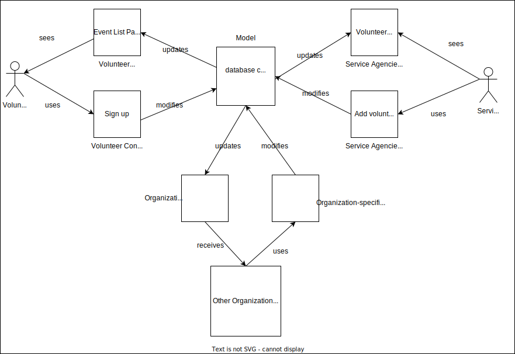

# Lab Report: Continuous Integration
___
**Course:** CIS 411, Spring 2021  
**Instructor(s):** [Trevor Bunch](https://github.com/trevordbunch)  
**Name:** Ammanuel Tamrat 
**GitHub Handle:** AmmanuelT 
**Repository:** https://github.com/AmmanuelT/cis411_lab2_arch 
**Collaborators:** 
___

# Step 1: Confirm Lab Setup
- [x] I have forked the repository and created my lab report
- [x] I have reviewed the [lecture / discsussion](../assets/04p1_SolutionArchitectures.pdf) on architecture patterns.
- [x] If I'm collaborating on this project, I have included their handles on the report and confirm that my report is informed, but not copied from my collaborators.

# Step 2: Analyze the Proposal
Serve Central is a system hoping to solve the problem of decreasing the number of volunteers in the U.S. Serve Central hopes to achieve this by making the process of volunteering easier for volunteers by creating a system that allows users to create one account through which they can view and sign up for opportunities.

## Step 2.1 Representative Use Cases  

| Use Case #1 | |
|---|---|
| Title | sign up for an event |
| Description / Steps |  1.0 Register for a volunteering opportunity   1.The volunteer specifies a location near which they can work   2.The system lists all the different events and also provides a map   3. The volunteer picks an event   4. The system sends the service agency a notification that the user wishes to volunteer and sends the necessary registration information   4. The volunteer receives a confirmation of the registration for the event |
| Primary Actor | Volunteer |
| Preconditions | 1. The user has already created an account   2. The user is signed in|
| Postconditions | 1. The volunteers registration information is stored by the service agency   2. The volunteer receives a reminder when the time of the event approaches |

| Use Case #2 | |
|---|---|
| Title | Publish an event |
| Description / Steps | 1.0 Publish an event   1. The service agency specifies the location, the category and the timeframe of the volunteering opportunity   2. The service agency specifies the information required from volunteers   3. The system sends confirmation that the event has been published |
| Primary Actor | Service Agency |
| Preconditions | 1. The Service Agency has created an account |
| Postconditions | 1. The volunteers near the event are notified of the new event |

## Step 2.2 Define the MVC Components

| Model | View | Controller |
|---|---|---|
| User Logins | Sign In Page | Login Controller |
| Users | Profile Page | Retreive User Information Controller |
| Events | Event list Page | Sign Up Controller |
| service Agencies| Add new service Agency page | Add new Service Agency Controller |

## Step 2.3 Diagram a Use Case in Architectural Terms
* Diagram of volunteer signing up for an event 

# Step 3: Enhancing an Architecture

## Step 3.1 Architecture Change Proposal
The MVC architectural pattern would still be appropriate in this case as the system is already using the architectural pattern. It would make it easier to implement the volunteer recruitment and management interface in the existing system by adding new views and controllers allowing the volunteer entities to retrieve data from the existing models. Using the MVC architectural pattern would also simplify the process of building organization-specific interfaces on top of the Serve Central business and data logic because we would only need to add a controller for the interfaces to interact with without changing the models.

An adverse effect of using MVC is the complexity of the overall system. Building and maintaining it will require knowledge of the diverse technologies that it is built on.

## Step 3.2 Revised Architecture Diagram
* Diagram of Enhacned Architecture

# Step 4: Scaling an Architecture
A peer-to-peer architecture is optimal for the new requirements of the system. First seeing the amount of traffic that the system would experience having the necessary information distributed among the different agencies will make it not only easier to access but less expensive than having an MVC architecture with models able to support such traffic. Storing the massive amount of data will also be easier in a peer-to-peer architecture as it will mean that the data will be more distributed. Another reason to switch from an MVC to a peer-to-peer is that coming up with a model that incorporates all the business rules for each service would be quite hard due to the scale.
