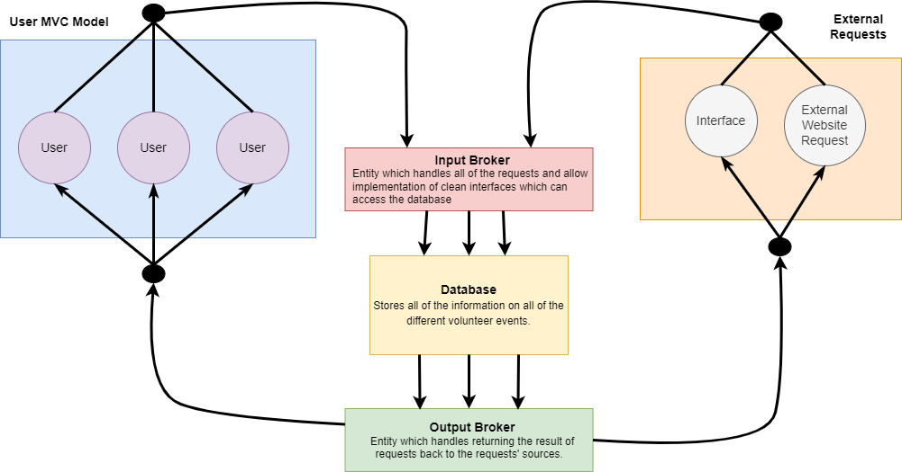

# Lab Report: Continuous Integration
___
**Course:** CIS 411, Spring 2021  
**Instructor(s):** [Trevor Bunch](https://github.com/trevordbunch)  
**Name:** Colin Robson 
**GitHub Handle:** @CRobson9000  
**Repository:** [My Repository](https://github.com/CRobson9000/cis411_lab2_arch)  
___

# Step 1: Confirm Lab Setup
&nbsp;&nbsp;&nbsp;&nbsp;I have completed all of the steps described in this part of the lab and I am not working with anyone else so I have no collaborators.  

# Step 2: Analyze the Proposal
&nbsp;&nbsp;&nbsp;&nbsp;Serve Central is aimed at connecting people who want to serve with the places that need people to serve.  It's a platform that compiles all of the registration information for events in an area, then allows users to see all of the events in their area and register to be apart of them.   

## Step 2.1 Representative Use Cases  

| Use Case #1 | |
|---|---|
| Title | Registering for an event |
| Description / Steps | A user (Sally) needs to be able to see all of the volunteer events in their area, then needs access to all of the registration information for that event.     <strong> Steps </strong>   1. Sally views all of the volunteer events in her area.   2. Sally selects an event from the list and clicks "Register".    3. Sally has access to all of the files she needs to be apart of this event and she can fill them out digitally in the app.   4. Sally clicks "Finish" and the organization recieves all of her information and forms to come to the event.  She then needs to wait until she is approved by the organization, where she will receive furthur instructions.      
| Primary Actor | Sally, an ordinary person who wants to serve her community|
| Preconditions | 1. An organization has created a volunteer event, which Sally can see.   2. Sally has created an account with her contact information and other important identification.   3. Sally lives in the area around where the event is going to take place|
| Postconditions | 1. The organization must review Sally's information and forms, then contact her to give her furthur instructions on what she she needs to do to get started.   2. Sally needs to follow through and participate in the event. |

| Use Case #2 | |
|---|---|
| Title | Creating a volunteer event |
| Description / Steps | A non-profit organization (Serve Central) is doing volunteer work and needs help from the community.  They need to create an event, which has all of its details and required forms for people to participate.   <strong> Steps </strong>  1. An organization goes to their events page, which lists all of their current volunteer events. They then click on "Create new event".   2. In this event, they can specify things like how many people they need, a location for the event, a description of what needs to be done, and a time estimate of how long the event will take.   3. They can then attach all of the required forms, which volunteers need to fill out to become a part of the event   4. When they are finished creating the event, they can click "Create" and it will show publically for all of the users in the area. |
| Primary Actor | Serve Central, a non-profit organizations that need volunteers  |
| Preconditions | 1. Serve Central must create an organization account where they talk about what they do and they include the areas they work in for the GPS algorithm. |
| Postconditions | 1. Users need to show interest in the event by submitting their forms   2. Serve Central needs to review the forms, then give them furthur individal instructions. |

## Step 2.2 Define the MVC Components

| Model | View | Controller |
|---|---|---|
| The database is updated with a new event and its information. | The tab which lists all of the events in an area is updated and shows the new event to the users. | The organization creates an event in the app and clicks "Create". |
| The database deletes the event, or updates a field named "Completed" to true. | In the tab which lists all of the events, the completed event either says "Completed" or is absent from the list. | The current time is outside that of an event, which means the event has ended or has already happened. |
| The database takes the update request and changes the data for that user internally. | A new location is now used to determine what events should show up for this user, so the view changes accordingly. | A user has moved or is on vacation and wants to change their location.  They update it in the profile section. |
| The website sends a message via email to the organization notifying them someone is interested, then adds that user to the "Interested" section of the row in the database for the event. | In the organization's inbox on the website, they can see the message and on the page for that event, a user is added under the "Needs Review" or "Interested" category | A user clicks "Submit" to submit their forms to do volunteer work for a company. |

## Step 2.3 Diagram a Use Case in Architectural Terms  

# Step 3: Enhancing an Architecture

## Step 3.1 Architecture Change Proposal
&nbsp;&nbsp;&nbsp;&nbsp;To add these features, I would propose adding a broker model of architecture, which would act as a layer that could oragnize requests to be sent to and from the database.  The MVC model could still remain plausible for normal volunteers and organizations who would like to be still be connected because the new features would not interact with this behavior.  Instead, a new group of entities (external websites including those of the 4 biggest volunteer organizations) would like to send and recieve information to the database through external requests from their website or other sources.  To separate these two big entities (the MVC model and the external requests from major volunteer companies) and streamline the request process to the database, two brokers can be used: one to receive data from these sources and another to send the resulting data back to apropriate sources.  
&nbsp;&nbsp;&nbsp;&nbsp;A benefit of this would be the process that connects the users to the database is streamlined and organized because a broker is being used.  A downside of this model would be that the connection between the two major entities first goes through the database, so if there is information needed from the other source and this information only lives in a source separated from the database, an extra layer of complexity is added.    
## Step 3.2 Revised Architecture Diagram

# Step 4: Scaling an Architecture
&nbsp;&nbsp;&nbsp;&nbsp; Since I believe that my previous design would scale well, I think I would keep the broker architecture and just add more sets of input brokers, output brokers, and databases (with servers).  I could separate the information any given viable entity would need into different kinds of data stored in different databases and have brokers on either side of each database to regulate the calls.  The input brokers would be able to efficiently put request calls out to their specific databases and the output brokers would easily be able to send the result back to its source, which would satisfy the third requirement.  This would also most likely be able to keep up with the latency requirement in the first requirement.  Having more databases would allow the company to store more data, which meets the 50TB of data requirement.  The volunteer companies would also be able to run analysis functions on their data in the database, which would help them see patterns and determine what future investments would be profitable.  A downside to this model is that how fast data can be processed is dependent on the number of database-broker sets that are needed to store all the data, so if a lot of sets are needed, the efficiency might be lower.  
