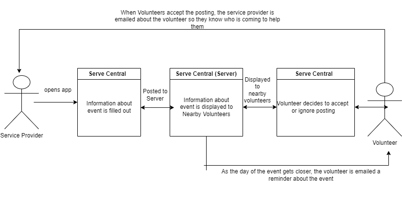

# Lab Report: Architecture
___
**Course:** CIS 411, Spring 2021  
**Instructor(s):** [Trevor Bunch](https://github.com/trevordbunch)  
**Name:** Shane Wahlberg  
**GitHub Handle:** CuriousOcean 
**Repository:**(https://github.com/CuriousOcean/cis411_lab2_arch)

**Collaborators:** 
___

# Step 1: Confirm Lab Setup
- [x] I have forked the repository and created my lab report
- [x] I have reviewed the [lecture / discsussion](../assets/04p1_SolutionArchitectures.pdf) on architecture patterns.
- [x] If I'm collaborating on this project, I have included their handles on the report and confirm that my report is informed, but not copied from my collaborators.

# Step 2: Analyze the Proposal
**Server Central Description**: Severe Central is a moblie app that allows users to quickly find events that are in need of volunteers. On the app, users can see how far, what kind of event, what kind of volunteers are needed, and they can keep track of what kind of work they've done and for how long. 

## Step 2.1 Representative Use Cases  

| Use Case #1 | |
|---|---|
| Title | Service Agency - Posting a Volunteer Listing |
| Description / Steps | As a service agency, I want to post my service event so that potential voluneeters can see my event and help<ol> <li> Owner of Service agency navigates to app and clicks on "Post Event" </li><li> User fills out information pertaining to event, such as how many people are needed and what kind of work is expected. </li> <li> User clicks post and the event is posted <ul> |
| Primary Actor | Service Agency |
| Preconditions | <ol> <li> Account Created for User</li> <li> There are users nearby that see the event  |
| Postconditions | User is informed about who is volunteering and reserves the right to decline their services  |

| Use Case #2 | |
|---|---|
| Title | Volunteer - Signing Up for Volunteer Listing |
| Description / Steps | I want to sign up for events to volunteer. <ol> <li> User navigates to "Map" feature </li> <li> Nearby volunteer opportunities are displayed, showing the distance from their location to the event. </li> <li> User click on the icon and is displayed what type of event, what kind of services, and how many more volunteers are need. </li> <li> After reading, the user has the option of clicking the "Sign me Up!" button or going back to select a different event. </li>  |
| Primary Actor |Volunteer |
| Preconditions | There are nearby events looking for volunteers.  |
| Postconditions | User is emailed a reminder about the event so they do not forget.  |

## Step 2.2 Define the MVC Components

| Model | View | Controller |
|---|---|---|
| Profile | Sign in Page | Email users reminder about event signed up for |
| Map | Map with Nearby Events | Notify service provider who has volunteered |
| Event | Profile for volunteer and service | Take down volunteer option once event has filled up |
| Email | Post a event tab | Tell volunteer profile the amount of hours and what type of events they have volunteered for overall |

## Step 2.3 Diagram a Use Case in Architectural Terms

# Step 3: Enhancing an Architecture

## Step 3.1 Architecture Change Proposal
INSERT Architectural change proposal here, and how it meets the two new requirements.  Explain both the benefits and draw backs of your proposal.

## Step 3.2 Revised Architecture Diagram
INSERT IMAGE HERE with a Description.

# Step 4: Scaling an Architecture
INSERT Architectural change proposal here, and how it meets the four new requirements.  Explain both the benefits and draw backs of your proposal.  If the changes are significant, then you need to explain why the changes are necessary versus a nice-to-have enhancement.

# Extra Credit
If you opt to do extra credit, then include it here.