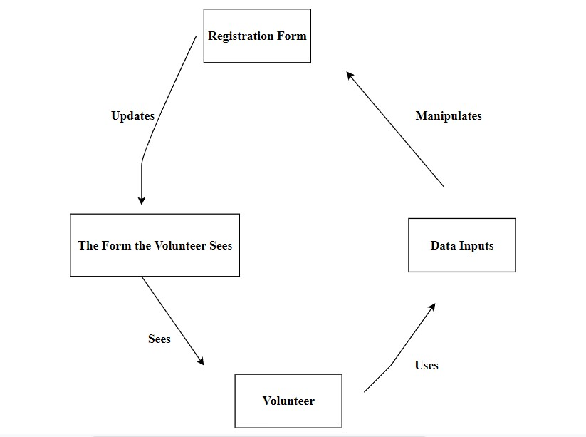
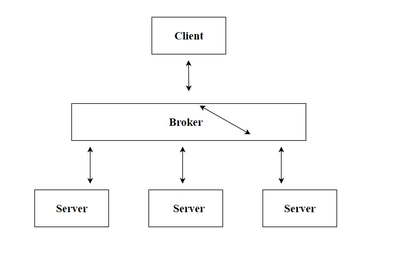

# Lab Report: Continuous Integration
___
**Course:** CIS 411, Spring 2021  
**Instructor(s):** [Trevor Bunch](https://github.com/trevordbunch)  
**Name:** Austin Dorsey  
**GitHub Handle:** Dorsecles  
**Repository:** Dorsecles
/
cis411_lab2_arch
  
**Collaborators:** 
___

# Step 1: Confirm Lab Setup
- [X] I have forked the repository and created my lab report
- [X] I have reviewed the [lecture / discsussion](../assets/04p1_SolutionArchitectures.pdf) on architecture patterns.
- [X] If I'm collaborating on this project, I have included their handles on the report and confirm that my report is informed, but not copied from my collaborators.

# Step 2: Analyze the Proposal
Serve Central ... This is an application that allows volunteers to find ways to serve and register all in the same place. It also helps the service companies because they can find volunteers easier.

## Step 2.1 Representative Use Cases  

| Use Case #1 | |
|---|---|
| Title |Volunteer finding service oppurtunities |
| Description / Steps |This use case describes how volunteers find volunteer oppurtunities |
| Primary Actor |Volunteer |
| Preconditions | <ol><li>Volunteer is authenticated and signed into their dashboard.</li><li>Available  volunteer events are listed on the dashboard</li><li>Registration for events is available on the application</li></ol> |
| Postconditions | <ol><li>Volunteer is registered for the event</li></ol> |

| Use Case #2 | |
|---|---|
| Title |Service agencies finding volunteers |
| Description / Steps |This use case describes how service agencies will find volunteers |
| Primary Actor |Service Agencies |
| Preconditions |<ol><li>Service agency creates event on the application</li><li>Volunteer registers for event</li></ol> |
| Postconditions |<ol><li>Service agency has a volunteer for their event</li></ol> |

## Step 2.2 Define the MVC Components

| Model | View | Controller |
|---|---|---|
| Registration Form | The form the volunteer sees | The inputs for the data on the form |
| Volunteer Dashboard | What the dashboard looks like | Navigation tools |
| Service Agency Dashboard | What the dashboard looks like | Navigation tools |
| Accepted Registration Screen | What it looks like | Confirmation button |

## Step 2.3 Diagram a Use Case in Architectural Terms

The registration form updates the view which is the form that the volunteer sees. Then the volunteer changes the registration form with the data inputs.

# Step 3: Enhancing an Architecture

## Step 3.1 Architecture Change Proposal
The Broker architecture could work. It is both simple and dynamic and still fits the needs of the company as of now. The only problem is the possibility of overhead/complexity.
## Step 3.2 Revised Architecture Diagram

There are multiple servers for the client to communicate with and they go through a broker.

# Step 4: Scaling an Architecture
Brokered architecture is the way to go in this scenario. Latency is not a problem with a brokered architecture. It can be scaled well so as your data increases the architecture will work with it. Authorized parties can find the data they are looking for with all the terabytes of data within the architecture. Also investors could find out about the data to see if it is a good investment. The problem is the possibility of overhead/complexity.

# Extra Credit
If you opt to do extra credit, then include it here.