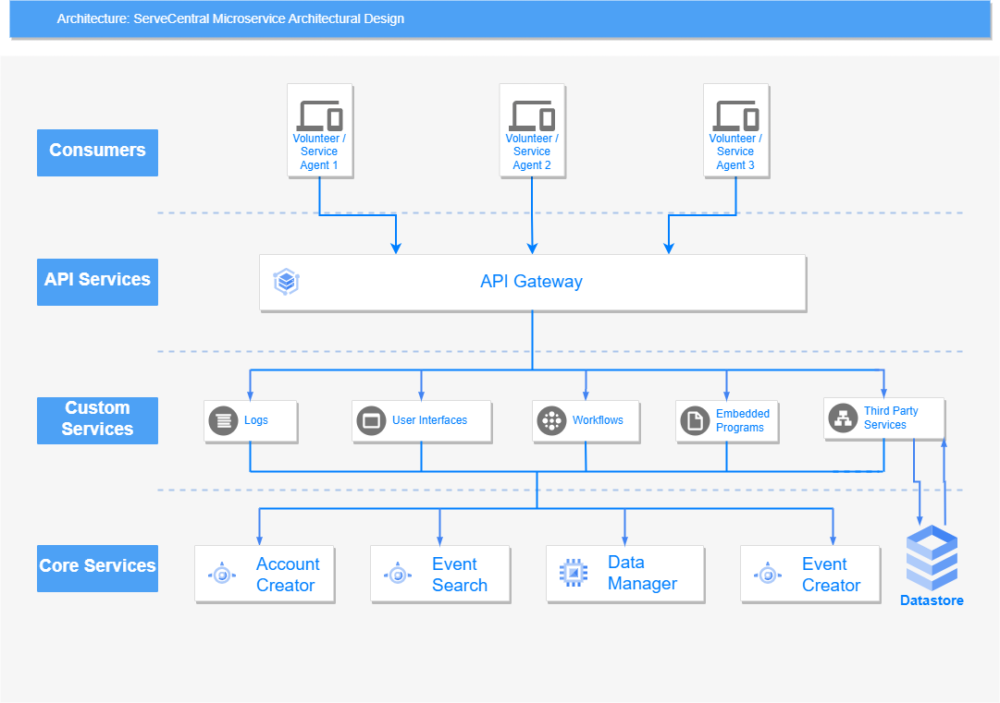

# Lab Report: Architecture
___
**Course:** CIS 411, Spring 2021  
**Instructor(s):** [Trevor Bunch](https://github.com/trevordbunch)  
**Name:** Justin Ayres  
**GitHub Handle:** JDAyres 
**Repository:** https://github.com/JDAyres/cis411_lab2_arch
**Collaborators:** Batman works alone...
___

# Step 1: Confirm Lab Setup
- [x] I have forked the repository and created my lab report
- [x] I have reviewed the [lecture / discsussion](../assets/04p1_SolutionArchitectures.pdf) on architecture patterns.
- [ ] If I'm collaborating on this project, I have included their handles on the report and confirm that my report is informed, but not copied from my collaborators.

# Step 2: Analyze the Proposal

Serve Central is a mobile app that will help connect people who wish to volunteer at local service events in their area. The goal of this app is to create an easy and convenient method to find, create, and sign up for service events.

## Step 2.1 Representative Use Cases  

| Use Case #1 | |
|---|---|
| Title | Volunteer Registers for an Event|
| Description / Steps | 1. User navigates to the desired event   2. User selects the event registration button on the desired event   3. User enters in their information  -----a. User enters in their data manually  -----b. User has data stored and application automatically enters the users data   4. User confirms registration once user data has been entered   5. Registration is submitted and user is faced with a registration confirmation screen   6. User is redirected back to the event search page|
| Primary Actor | Volunteer|
| Preconditions | 1. User is logged into their app   2. User has agreed to applications terms and conditions   3. User has allowed app to use their location   4. A service agency properly created the event   5. User is connected to the internet|
| Postconditions | 1. User can access their registered events in a single page in the application   2. if the user has set agreed to email notifications a confirmation email will be sent|

| Use Case #2 | |
|---|---|
| Title | Service Agency Adds/Creates an Event on the App|
| Description / Steps | 1. The Service Agent navigates to the event creator page   2. The Service Agent selects the "Add New event" button   3. The Service Agent enters in all required information   --- Name   --- Location   --- Date/Time   --- Number of volunteers needed   --- Description   4. The Service Agent selects the "Create Event" button   5. Event creation request goes through   6. Event is confirmed by ServeCentral   -----a. Event is Confirmed by ServeCentral; complete process   -----b. Event is denied by ServeCentral; return to step 1|
| Primary Actor | Service Agent(Agency)|
| Preconditions | 1. Service Agency has created and logged into their account   2. Service Agency has been checked and deemed legitimate   3. the Service Agency has agreed to the terms and conditions of the app   4. The Service Agency is connected to the internet|
| Postconditions | 1. The Service Agency receives a confirmation email once event has been confirmed   2. Event is displayed for volunteers on event map and event list|

## Step 2.2 Define the MVC Components

| Model | View | Controller |
|---|---|---|
| Account Creator | Account Creation Form | viewAccountCreationController |
| Event Creator | Event Creation Form | viewEventCreationController |
| Local Event Map | Local Event Map | viewLocalEvenMapController |
| Event Sign Up | Event Sign Up Form | viewEventSignUpController |

## Step 2.3 Diagram a Use Case in Architectural Terms
INSERT IMAGE HERE with a Description.

# Step 3: Enhancing an Architecture

## Step 3.1 Architecture Change Proposal
An architectural pattern that would work well with ServeCentral's mission would be a microservice architectural pattern. This is because this architectural form works well with simple application programming interfaces (APIs) as well as web based applications. Since ServeCentral would like to potentially embed their application within things like churches websites, this architecture will support that ideal. In addition this architecture allows for quick and easy deployments, so adapting to things like browser updates is easier. Additionally, microservice architecture is also very flexible in design, making the use of third party services easier to implement. Unfortunately there are still drawbacks to this architecture, the biggest for this case scenario is that the implementation of this architecture will require a lot of resources. So, sadly it is a fairly expensive solution.

## Step 3.2 Revised Architecture Diagram

**Description:**   This is a microservice architecture diagram designed around ServeCentral that meets the two described problems needs, the two problems being,   1. Thirdparty services to both input and retrieve data from the Serve Central model/datastore.   2. Building organization-specific interfaces on top of the Serve Central business and data logic.

# Step 4: Scaling an Architecture
I believe that the microservice architecture is still the ideal architecture to meet the desired needs of the Gates Foundations grant.

This is because the microservice architecture is designed to be easily scalable which allows for adaptations to situations akin this.

In terms of changes to the architectural design, I would make the following recommendations, 
  1. Include a load balancer within the API Gateway, this will help with the new increase in users.
  2. To address the new storage concerns, you can either acquire your own hardware, however that would require that you handle all of the maintenance. With the microservice architecture acquiring third party storage would be a easier and friendlier option. On this storage site, an application like MySQL should be running which will allow database queries. 
  3. I would add a new type of account, a researcher account, one that allows access to specific portions of the data servers, this would be used by the researchers examining volunteer opportunity patterns.

# Extra Credit
If you opt to do extra credit, then include it here.