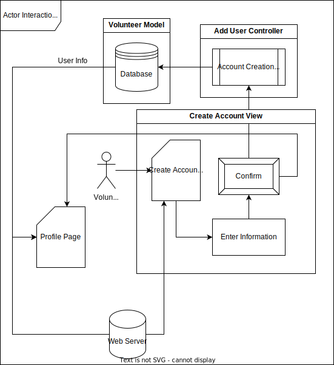
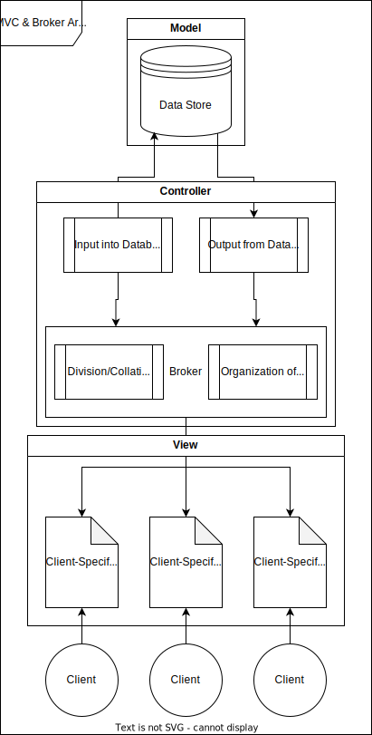

# Lab Report: Continuous Integration
___
**Course:** CIS 411, Spring 2021  
**Instructor(s):** [Trevor Bunch](https://github.com/trevordbunch)  
**Name:** Your Name  
**GitHub Handle:** Your GitHub Handle  
**Repository:** Your Forked Repository  
**Collaborators:** 
___

# Step 1: Confirm Lab Setup
- [x] I have forked the repository and created my lab report
- [x] I have reviewed the [lecture / discsussion](../assets/04p1_SolutionArchitectures.pdf) on architecture patterns.
- [x] If I'm collaborating on this project, I have included their handles on the report and confirm that my report is informed, but not copied from my collaborators.

# Step 2: Analyze the Proposal
Serve Central is a mobile application designed to make it easier for users to find nearby volunteer opportunities. It can locate charities and other volunteer events, as well as allow for RSVPs and track total hours across events.

## Step 2.1 Representative Use Cases  

| Use Case #1 | |
|---|---|
| Title | Volunteer - Sign Up for Service Event |
| Description / Steps | **As a potential ServeCentral user, I want to find and sign up for a service event near me** |
| Steps | 1. A user navigates to the search menu in the ServeCentral app   2. The user inputs the name of the event they want to join in the search bar   3. The user selects the event they wish to sign up for from the list of events in the search menu   4. The user clicks on the `Sign Up` button on the event page |
| Primary Actor | Volunteer |
| Preconditions | The user has already created an account on the service |
| Postconditions | 1. The user is signed up for a service event   2. The user can access information about the event through a menu in the app   3. The user can view the location of the event on a map in the app |

| Use Case #2 | |
|---|---|
| Title | Service Agency - Post Event |
| Description | **As a service agency, I want to add an upcoming event to ServeCentral so volunteers can sign up for it** |
| Steps | 1. A representative user of the service agency selects `Add Event` from their profile page   2. The user fills in the form on the following page (Location, Address, Time, Description, Minimum/Maximum Participants)   3. The user confirms the posting of the event |
| Primary Actor | Service Agency |
| Preconditions | The agency has already added themselves to ServeCentral as a service agency |
| Postconditions | 1. The event to be hosted by the agency is added to ServeCentral's database   2. The event to be hosted by the agency can be found on the agency's profile page |

## Step 2.2 Define the MVC Components

| Model | View | Controller |
|---|---|---|
| Volunteers | Create Account | Add User |
| Service Agencies | Profile | Add Event |
| Events | Map | Update Volunteer Count for Event |
| Map Data | Search for Event | Search Events |

## Step 2.3 Diagram a Use Case in Architectural Terms

# Step 3: Enhancing an Architecture

## Step 3.1 Architecture Change Proposal
In order to allow for third parties to more easily interact with this system, a broker system should be added to the architecture. This broker would allow any third party to interact with their own version of ServeCentral's interface, customized by the client to meet whatever needs are necessary by that client. Then, through the broker, data from each client's interface would be standardized and sent to the primary datastore. This would allow each client to interact with the same data model, regardless of how their interface is set up.

Because of this customizability, the addition of a broker would add transparency to each client's service. Their custom interface would have its own feel, making it appear as a separate entity while simultaneously being a part of the main system. In addition, each interface can be updated independently of the other interfaces, allowing multiple separate clients to interact with the service without impeding one another.

The primary downside of this change would be the added complexity of creating and managing a client. Smaller organizations without as much workforce would have a harder time properly managing their client, which would add an entry barrier to using the service. However, this is a relatively minor and easy to solve problem added by a major upgrade, so the downside is worth accepting.

## Step 3.2 Revised Architecture Diagram

# Step 4: Scaling an Architecture
For the most part, the current architecture will be capable of supporting the additional needs of this scaled up project. What needs to change is not the structure of the model, but rather the devices and processing components needed for it to function.

The data store would have to be upgraded from a single storage device to a network of them across multiple regions. In order to minimize latency, there would need to be multiple data servers in various locations around the world that each client could connect to. These servers would then need to be interconnected to support the massive amount of storage capacity needed, dividing the 50+ TB of data across every server rather than having it centralized in one location.

This data store upgrade would cover the majorty of the new requirements; having multiple storage locations would minimize latency, the necessary amount of data storage would be met across all the various server locations, and servers could process multiple queries at once in order to expedite their duration.

In order to accomodate for the fourth requirement, an additional controller would need to be added that would allow certified users to access statistical data about other users. The collation of statistical data would be a non-issue with the new data store, but a new way to access it by approved parties would be necessary.

The implementation of this upgrade would allow for the expansion of ServeCentral that would be necessary for it to be usable worldwide. The division of storage across the world would make it easier to store and process all the neccessary information, in addition to being easily expandable once put into place. However, such an endeavor would be costly, and it would become much more difficult to manage every data store from one place. Besides the costs of implementation, there would also be expenses for hiring individuals to perform upkeep on each server. Despite this cost, the worldwide implementation of ServeCentral would greatly pay for itself, leading to easily accessible volunteer opportunities for all.

# Extra Credit
If you opt to do extra credit, then include it here.