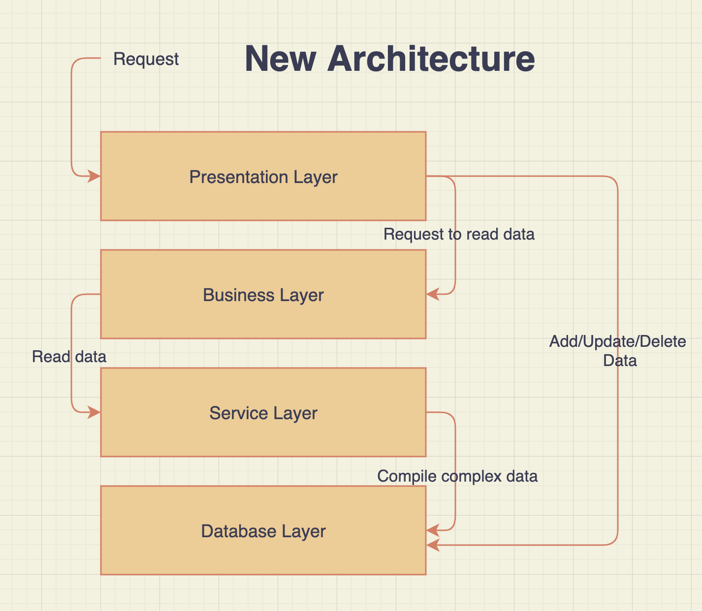

# Lab Report: Continuous Integration
___
**Course:** CIS 411, Spring 2021  
**Instructor(s):** [Trevor Bunch](https://github.com/trevordbunch)  
**Name:** Reid Burger   
**GitHub Handle:** @ReidBurger  
**Repository:** https://github.com/ReidBurger/cis411_lab2_arch  
**Collaborators:** None
___

# Step 1: Confirm Lab Setup
- [x] I have forked the repository and created my lab report
- [x] I have reviewed the [lecture / discsussion](../assets/04p1_SolutionArchitectures.pdf) on architecture patterns.
- [x] If I'm collaborating on this project, I have included their handles on the report and confirm that my report is informed, but not copied from my collaborators.

# Step 2: Analyze the Proposal
Serve Central is website and mobile app that puts all volunteer opporunities in the area in one place and streamlines the application process.

## Step 2.1 Representative Use Cases  

| Use Case #1 | |
|---|---|
| Title | Retrieve Volunteer Opportunities |
| Description / Steps | This will search the area surrounding the actor and return volunteer events nearby. First, the actor's location is deterined, then we find all events in a certain radius from that point, then we return all those events to the actor in the form of a nicely diplayed UI. |
| Primary Actor | Volunteers |
| Preconditions | The actor needs to have location services on and we need to have locations of volunteer opportunitites saved in our database, as well as a way to calculate distance from current location to event location. |
| Postconditions | The results should be displayed for the actor and they should be able to see more details about each event, retrievin them from our database. |

| Use Case #2 | |
|---|---|
| Title | Upload Volunteer Opportunity |
| Description / Steps | Actors will be able to enter information about their service opportunity, including name, description, date, time, location, and maximum volunteers. They can then click "submit" and officially register it in the database. |
| Primary Actor | Service Agencies |
| Preconditions | The actor must create an account so that we know who to hunt down if the event is spam, and we need to have a way to add info to the database regarding all an event's attributes and a way for volunteers to retrieve it. |
| Postconditions | The actor must have a way of checking on the event to see how many people are signed up to volunteer, and the database must automatically un-display the event in the main volunteer search page once the event has passed. |

## Step 2.2 Define the MVC Components

| Model | View | Controller |
|---|---|---|
| Updates results page with data and pins locations of events on the map | Search bar, map, and results page | Gets data from search bar, tells model to get data about events nearby |
| Adds a new event and all related data to database | Add opportunity form | Gets data from form, tells model to add event to database |
| Gets data about an event (name, date, time, etc.) and displays it on the page | Event Details page | Gets data from which event you click, tells model to retrieve data about event |
| Finds the data related to the user and displays it on the profile page | Profile page | Checks user ID and tells model to get the corresponding data |

## Step 2.3 Diagram a Use Case in Architectural Terms

This diagram describes the actor (volunteer) requesting info about events nearby. The pre-condition is in parenthesis.

This MVC diagram describes this same interaction: the actor (volunteer) interacts with the view and sends the request for data to the controller, which in turn relays it to the model and updates the view.

# Step 3: Enhancing an Architecture

## Step 3.1 Architecture Change Proposal
The new architecture could follow the Layered approach. Each task could be split into a separate layer since businesses oftentimes don't need to go down to the write/update/delete database layer. The layer would be split into Presentation (similar to View), Business (for retreival logic), Services (where data can be viewed), and Database (where information is stored and can be written/updated/deleted). 

Pros
- **Third party services** can access all the info they need by going to the Service layer
- Direct database access is reduced by separating the database-changing layer from the view layer.
- **Interfaces** can be built by only going down to the Service layer, which is a lighter load for the system to handle than the database layer
- The database layer only needs to be accessed by third party services (for adding events) and by the system itself (for deleting past events or adding to the number of volunteers)
- The database layer can be reached by the service layer if there is complex data that needs to be retrieved, i.e. data that can needs to be combined with other data

Cons
- The first three layers are usually accessed together since you don't often stop at the logic with no data to read
- This doesn't help to reduce the load when extreme stress is placed on the system by lots of people updating or changing data at once
- If an upper layer is broken, it will halt the transaction

## Step 3.2 Revised Architecture Diagram

The new architecture shows how when a request is made, it can stop at each layer if necessary or continue if more information is needed. Additionally, if an add/update/delete request is made, the middle two layers can be skipped. Alternatively, if there is only data to be read, it can go down through the layers on a separate path.

# Step 4: Scaling an Architecture
INSERT Architectural change proposal here, and how it meets the four new requirements.  Explain both the benefits and draw backs of your proposal.  If the changes are significant, then you need to explain why the changes are necessary versus a nice-to-have enhancement.

A new architecture to consider would be a Microservice approach. This would solve each problem presented as follows.
- Bursts of 10K+ volunteers, low latency
    - The broker will distribute users to each specific task they are completing so that there is little overlap between servers operating in parallel
    - Each segment operating in parallel will be able to only use what it needs and free up memory for other users to use the same or different operations
- Large volunteer and event data store
    - The store can be saved as a separate database and can be accessed the same way as other things- the broker will do the request handling
    - The store can be broken into segments and tasks can be directed to the corresponding segment to free up memory for other users
- Allow queries to be issued by third parties
    - The broker can allow access to the database if certain permissions are met 
    - Queries can be carried out and results given without interrupting the main flow of the database because they execute on a copy of the database that is operating alongside the real one
- Examine patterns in data
    - An API can be created for data analytics and used similarly to the above point
    - Makes a personal copy of the database for you to manipulate without altering the actual database
