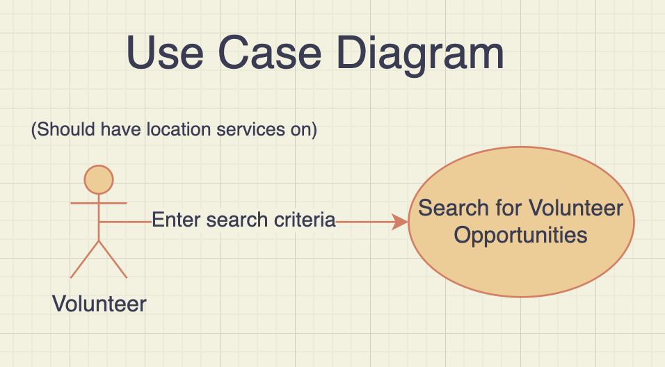

# Lab Report: Continuous Integration
___
**Course:** CIS 411, Spring 2021  
**Instructor(s):** [Trevor Bunch](https://github.com/trevordbunch)  
**Name:** Reid Burger   
**GitHub Handle:** @ReidBurger  
**Repository:** https://github.com/ReidBurger/cis411_lab2_arch  
**Collaborators:** 
___

# Step 1: Confirm Lab Setup
- [x] I have forked the repository and created my lab report
- [x] I have reviewed the [lecture / discsussion](../assets/04p1_SolutionArchitectures.pdf) on architecture patterns.
- [x] If I'm collaborating on this project, I have included their handles on the report and confirm that my report is informed, but not copied from my collaborators.

# Step 2: Analyze the Proposal
Serve Central is website and mobile app that puts all volunteer opporunities in the area in one place and streamlines the application process.

## Step 2.1 Representative Use Cases  

| Use Case #1 | |
|---|---|
| Title | Retrieve Volunteer Opportunities |
| Description / Steps | This will search the area surrounding the actor and return volunteer events nearby. First, the actor's location is deterined, then we find all events in a certain radius from that point, then we return all those events to the actor in the form of a nicely diplayed UI. |
| Primary Actor | Volunteers |
| Preconditions | The actor needs to have location services on and we need to have locations of volunteer opportunitites saved in our database, as well as a way to calculate distance from current location to event location. |
| Postconditions | The results should be displayed for the actor and they should be able to see more details about each event, retrievin them from our database. |

| Use Case #2 | |
|---|---|
| Title | Upload Volunteer Opportunity |
| Description / Steps | Actors will be able to enter information about their service opportunity, including name, description, date, time, location, and maximum volunteers. They can then click "submit" and officially register it in the database. |
| Primary Actor | Service Agencies |
| Preconditions | The actor must create an account so that we know who to hunt down if the event is spam, and we need to have a way to add info to the database regarding all an event's attributes and a way for volunteers to retrieve it. |
| Postconditions | The actor must have a way of checking on the event to see how many people are signed up to volunteer, and the database must automatically un-display the event in the main volunteer search page once the event has passed. |

## Step 2.2 Define the MVC Components

| Model | View | Controller |
|---|---|---|
| Updates results page with data and pins locations of events on the map | Search bar, map, and results page | Gets data from search bar, tells model to get data about events nearby |
| Adds a new event and all related data to database | Add opportunity form | Gets data from form, tells model to add event to database |
| Gets data about an event (name, date, time, etc.) and displays it on the page | Event Details page | Gets data from which event you click, tells model to retrieve data about event |
| Finds the data related to the user and displays it on the profile page | Profile page | Checks user ID and tells model to get the corresponding data |

## Step 2.3 Diagram a Use Case in Architectural Terms

This diagram describes the actor (volunteer) requesting info about events nearby. The pre-condition is in parenthesis.

This MVC diagram describes this same interaction: the actor (volunteer) interacts with the view and sends the request for data to the controller, which in turn relays it to the model and updates the view.

# Step 3: Enhancing an Architecture

## Step 3.1 Architecture Change Proposal
INSERT Architectural change proposal here, and how it meets the two new requirements.  Explain both the benefits and draw backs of your proposal.

## Step 3.2 Revised Architecture Diagram
INSERT IMAGE HERE with a Description.

# Step 4: Scaling an Architecture
INSERT Architectural change proposal here, and how it meets the four new requirements.  Explain both the benefits and draw backs of your proposal.  If the changes are significant, then you need to explain why the changes are necessary versus a nice-to-have enhancement.

# Extra Credit
If you opt to do extra credit, then include it here.