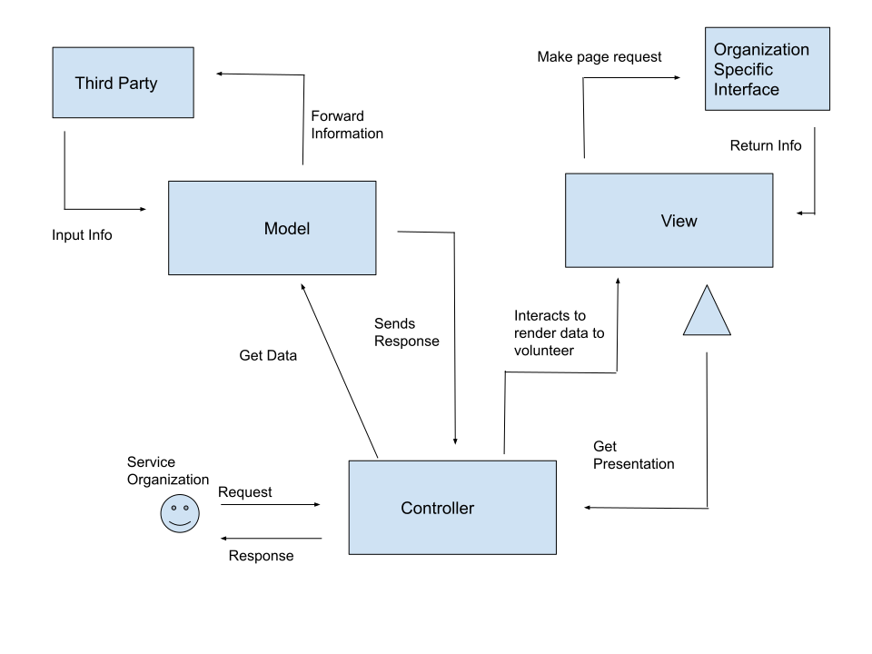

# Lab Report: Continuous Integration
___
**Course:** CIS 411, Spring 2021  
**Instructor(s):** [Trevor Bunch](https://github.com/trevordbunch)  
**Name:** Azianna Yang  
**GitHub Handle:** ay1191  
**Repository:** (https://github.com/ay1191/cis411_lab2_arch.git) 
**Collaborators:** Isaac Ho [isaachhm] with revising the architecture.
___

# Step 1: Confirm Lab Setup
- [x] I have forked the repository and created my lab report
- [x] I have reviewed the [lecture / discsussion](../assets/04p1_SolutionArchitectures.pdf) on architecture patterns.
- [x] If I'm collaborating on this project, I have included their handles on the report and confirm that my report is informed, but not copied from my collaborators.

# Step 2: Analyze the Proposal
Serve Central ... ENTER A BASIC SYSTEM INTRODUCTION HERE (1-2 Sentences).

Serve Central's main purpose is to solve issues with volunteering researching. They see that finding new volunteer oportunities is hard, inconsistent and confusing. Their solution is to use user statistic tracking and compose all the event/company information in one location where the user can register.

## Step 2.1 Representative Use Cases  

| Use Case #1 | |
|---|---|
| Title | Volunteer Opportunities |
| Description / Steps | 1. Volunteer selects event   2. Volunteer enters event registration information   3. Volunteer confirms registration   4. Confirmation is sent to the company/organization that the volunteer registered for.   5. Volunteer is given more information about the event such as time and place.|
| Primary Actor | Volunteer |
| Preconditions | 1. Volunteer must create an account|
| Postconditions | 1. Event must update volunteer's account after he attended the event.   2. Event updates to show number of attendees registered. |

| Use Case #2 | |
|---|---|
| Title | Service Agency |
| Description / Steps | 1. Company enters information on event registration page [date of event, location, meeting time, and service event description etc.]   2. Organization confirms registration |
| Primary Actor | Company hosting the service event |
| Preconditions | 1. Company must create and account   2. Company must be verified |
| Postconditions | 1. The event is live for volunteers to see   2. Number of attendees must be updated hourly |

## Step 2.2 Define the MVC Components

| Model | View | Controller |
|---|---|---|
| Company | Company Information Page  | ShowProfileController  |
| Location | Map Page | MapPageController |
| Event Name | Event Feed | VolunteerOptionsController |
| Event Description | Event Information Page | EventPageController |

## Step 2.3 Diagram a Use Case in Architectural Terms

In order for the volunteer to create an account to see the volunteer event opportunities, they must send a create account request to the controller. The controller receives the request and asks the model for information based on the request. The model handles the data of the request and interacts with the database. It then sends the response back to the controller. The controller receives the resonse and interacts with the view to render the data back to the volunteer. The view handles the final presentation of the data. It acts as a template file that dynamically renders HTML based on the data that the controller sent it. The controller then gets the presentation from the view and sends a response back to the volunteer to see that their account has been created and confirmed.

# Step 3: Enhancing an Architecture

## Step 3.1 Architecture Change Proposal
Even with the new additions/requirements, I would continue using MVS as the architectural model. It would be difficult to switch architectural models without facing drawbacks and issues. We also just had a successful time of operation. I would suggest create an API. An API (Application Programming Interface) is a gateway that allows software to talk to other software. We will need this if we are connecting to chapters across the country. One potential issue of this choice is that it may become difficult and complicated to maintain and may be hard for the view to update efficently if there are frequent changes.

## Step 3.2 Revised Architecture Diagram

This aritecture diagram enhancement adds the third party to the model. The service organization first makes a request to create a service event. The controller receives the request and sends the data to the model. The model handles the data and interacts with the database. Then, it can forward the information to the third party. The third party returns the info. The model sends the results and the controller recieves it. It's then sent to view. I added a fork so that the user can pull information directly off that specific organization.

# Step 4: Scaling an Architecture
With the increase of volunteer opportunities and data, I would implement load balancing. Load balancing refers to the process of distributing a set of tasks over a set of resources with the aim of making the overall processing more efficient. Load balancing will optimize the response time and avoid overloading. This should help support the 50TB of data. I would also add additional security since we are adding other parties to the model. We need to reduce the chances of those parties gaining vulnerable data.

# Extra Credit
If you opt to do extra credit, then include it here.