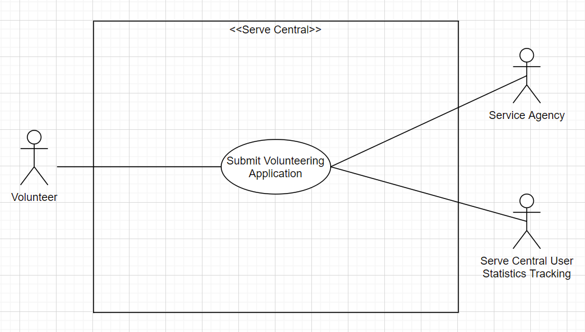

# Lab Report: Architecture
___
**Course:** CIS 411, Spring 2021  
**Instructor(s):** [Trevor Bunch](https://github.com/trevordbunch)  
**Name:** Abigail Garrido  
**GitHub Handle:** ag1454  
**Repository:** https://github.com/ag1454/cis411_lab2_arch  
**Collaborators:** n/a (#madscientistlife...I did have my dad (Randy) help me with this, though)
___

# Step 1: Confirm Lab Setup
- [**X**] I have forked the repository and created my lab report
- [**X**] I have reviewed the [lecture / discsussion](../assets/04p1_SolutionArchitectures.pdf) on architecture patterns.
- [**X**] If I'm collaborating on this project, I have included their handles on the report and confirm that my report is informed, but not copied from my collaborators.

# Step 2: Analyze the Proposal
Serve Central is a system that allows for users to see all volunteering opportunities within a certain area and register for them in one simple application. The app also tracks user statistics for organizations.

## Step 2.1 Representative Use Cases  

| **Use Case #1** | |
|---|---|
| **Title** | Volunteer Submits Application |
| **Description** | This use case describes how a volunteer applies for a volunteering opportunity. |
| **Steps** | <ol><li>Volunteer finds a volunteer opportunity of interest.</li><li>Volunteer fills out the application form for the volunteer opportunity and submits it once complete.</li></ol> |
| **Primary Actor** | Volunteer |
| **Preconditions** | <ol><li>Volunteer has a Serve Central account and is logged in.</li></ol> |
| **Postconditions** | <ol><li>Service agency receives application from volunteer for review.</li></ol> |

| **Use Case #2** | |
|---|---|
| **Title** | Service agency hosts an event on Serve Central |
| **Description** | This use case describes how a service agency hosts on event on Serve Central. |
| **Steps** | <ol><li>Service agency inputs volunteering event information.</li><li>Service agency uploads event information to Serve Central</li></ol> |
| **Primary Actor** | Service Agency |
| **Preconditions** | <ol><li>Serve Central has a special account option for service agencies.</li><li>Service agency has a Serve Central account and is logged in.</li></ol> |
| **Postconditions** | <ol><li>The service agency's event is able to be viewed by volunteers looking for volunteering opportunities.</li></ol> |

## Step 2.2 Define the MVC Components

| Model | View | Controller |
|---|---|---|
| model receives location info | view shows volunteering opportunities near the location info | user inputs location into map |
| model is notified that the user has switched displays | view displays the volunteering events list | user toggles to events list |
| model is notified that a user has logged into the system | view displays what a logged in user would see | user logs into Serve Central |
| model receives the completed volunteering application and the type of volunteering signed up for | view updates to notify the user that their application has been submitted and adds the type of volunteering to their types of volunteering hours statistics | user submits volunteering application |

## Step 2.3 Diagram a Use Case in Architectural Terms

The actor (Volunteer) performs a volunteering application submission action (Controller). The service agency and the Serve Central user statistics tracking will receive the application and type of volunteering that the volunteer applied for, respectively (Model). Volunteer will be notified that their application went through and their statistics will change (View).

# Step 3: Enhancing an Architecture

## Step 3.1 Architecture Change Proposal
Proposed architectural change: broker architecture. Both of the proposed changes to the architecture involve either third-parties accessing Serve Center or Serve Center accessing third-parties. Advantages include transparent service distribution for clients and support of dynamic CRUD. A disadvantage is potential complexity for smaller products.

## Step 3.2 Revised Architecture Diagram
INSERT IMAGE HERE with a Description.

# Step 4: Scaling an Architecture
INSERT Architectural change proposal here, and how it meets the four new requirements.  Explain both the benefits and draw backs of your proposal.  If the changes are significant, then you need to explain why the changes are necessary versus a nice-to-have enhancement.

# Extra Credit
If you opt to do extra credit, then include it here.