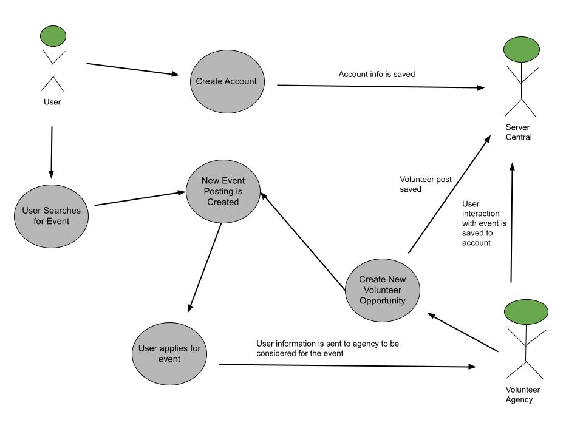
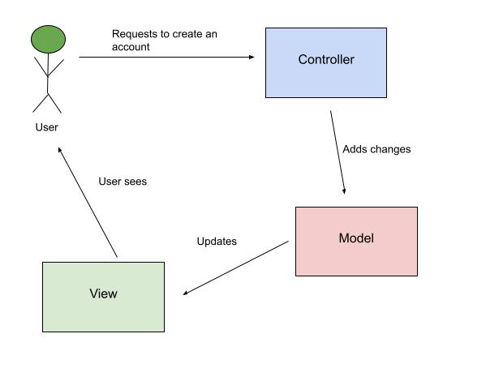
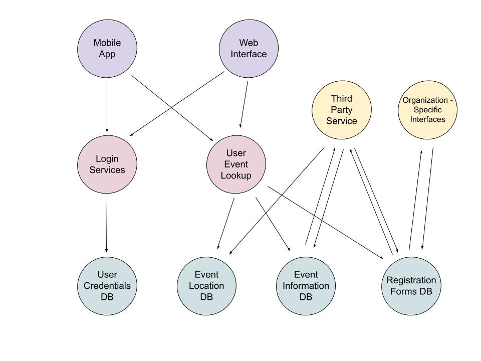
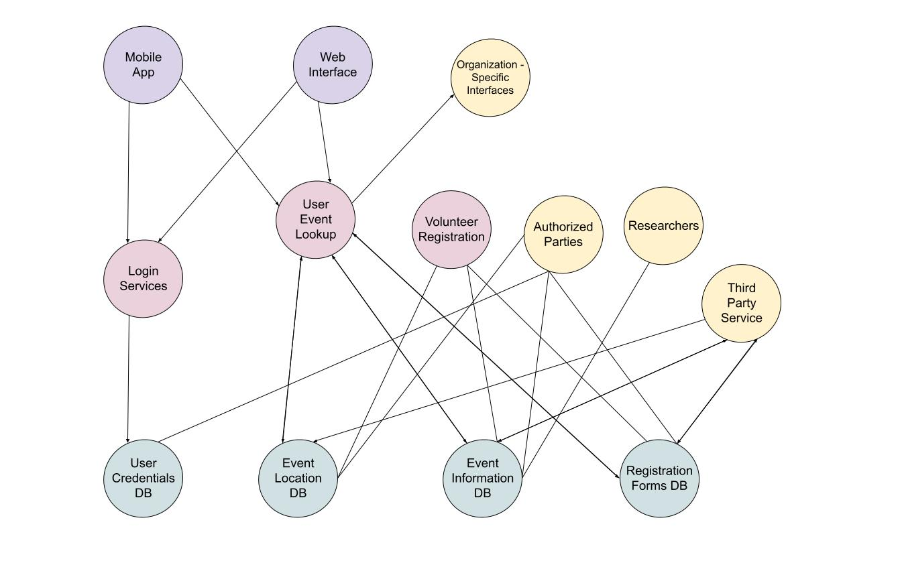

# Lab Report: Continuous Integration
___
**Course:** CIS 411, Spring 2022  
**Instructor(s):** [Trevor Bunch](https://github.com/trevordbunch)  
**Name:** Grace Schlauder  
**GitHub Handle:** grace-schl  
**Repository:** [My Forked Repository](https://github.com/grace-schl/cis411_lab2_arch)  
**Collaborators:** [Michael Mourelatos](https://github.com/MichaelMourelatos) and [Andrew Coldsmith](https://github.com/andrewcoldsmith)
___

# Step 1: Confirm Lab Setup
- [X] I have forked the repository and created my lab report
- [X] I have reviewed the [lecture / discsussion](../assets/04p1_SolutionArchitectures.pdf) on architecture patterns.
- [X] If I'm collaborating on this project, I have included their handles on the report and confirm that my report is informed, but not copied from my collaborators.

# Step 2: Analyze the Proposal
Serve Central is an application that allows for users to have all volunteering information in their area at the tip of thier fingers. Companies can post about different volunteering oppotunities they are offering and then users can register if interested. 

## Step 2.1 Representative Use Cases  

| Use Case #1 | |
|---|---|
| Title | Volunteer Posting |
| Description | A representitive for a company posts any volunteer opportunities that are currently available. |
| Steps | 1. Representitive logs into the company's account |
| | 2. Representative selects to create a new volunteer listing |
| | 3. System provides a template for filling in the needed information (such as description of volunteer work, experience needed, hours of service, company contact infromation, etc.) |
| | 4. Representitive selects that the listing is completed once all information has been imput | 
| | 5. The listing is posted to the company's account |
| | 6. A notification is sent out to any users who have turned on notification requests |
| Primary Actor | The company representative |
| Preconditions | 1. The representative is authorized to log into an account that |
| | 2. The account is validated as being associated with said company |
| Postconditions | 1. The listing is posted to the company's account |
| | 2. A notification is sent out to any users who have set up notification requests |

| Use Case #2 | |
|---|---|
| Title | User Application |
| Description | A user applying for their preferred volunteer opportunity. |
| Steps | 1. User logs into their account |
| | 2.  User navigates to the preferred volunteer opportunity listing|
| | 3. User selects the opption to apply for opportunity ("Apply" button) |
| | 4. User is directed to a page with prompts to fill out all of the information that the company needs about the user|
| | 5.  User submits their application for volunteer opportunity|
| | 6. Application is sent to company |
| | 7.  User recieves an email or text that confirms that their application has been completed |
| Primary Actor | The user recieves either an email or text that informs them that their application has successfully been completed|
| Preconditions | The user is logged into an account that has been verified through email or phone number|
| Postconditions | 1. The user's application has been sent to the company |
| | 2. The user recieves an email or text that confirms that their application has been completed |

## Step 2.2 Define the MVC Components

| Model | View | Controller |
|---|---|---|
| Login | Login Page | CredentialController |
| Oranization | Organization Page | OrganizationInfoController |
| Location | Event Map | EventLocationController |
| Event Registration | Registration Form | EventRegistrationController |

## Step 2.3 Diagram a Use Case in Architectural Terms
The diagram below shows the relation between a user, server central, and the volunteer agency. The proccess within the diagram is the user creating an account, the volunteer agency posting a new event, and the user sending the agency an application form.

This diagram shows what happens within an MVC model when the user interacts with the application.

# Step 3: Enhancing an Architecture

## Step 3.1 Architecture Change Proposal
My proposal for changing the architecture is to switch from the MVC model to the Microservice model. Microservices is comparable to MVC, but the main difference is that Microservices do not share a data layer. Each microservice connected to the user interface has its own database and is seprate from other microservices.

Microservices will be benefitial for the first new requirement because the third party services can be associated with their own microservice and database. This way the third party services will have full access to their own database that they can upload and retrieve data from, without having to sift through other data that does not belong to them or isn't needed. 

Microservices will also be beneficial for the second new requirement because the registration services can be part of their own database that websites can access and embed as needed.

A disadvantage to switching to microservices is that the MVC model is easier to start out using. MVC helps to reduce project development time since it is only divided into three distinct sections. So with using microservices, development might take longer and be slightly more complicated to integrate at first. However, in the long run, it will be worth it because it will already be set up for future growth.

## Step 3.2 Revised Architecture Diagram
This diagram shows how the mobile app and web interface would access different microservices connecting to the corresponding databases. It also shows how third party services would have access to upload and recieve information from the appropriate databases. Organization-specific interfaces are also shown with their appropriate connections to databases.

# Step 4: Scaling an Architecture
For a scaling architecutre, I would keep the microservice architecture. 

1. This architecture is able to tackle latency problems because certain tasks are being performed on a single service. So volunteer requests will be going through a specified micoservice that connects to the needed databases which will keep all of the activity separated from other services.
2. Since the data is separated into different databases, storage isn't really much of an issue. If space does become an issue, I imagine that adding another database for the overflow data would be possible.
3. Authorized parties would be allowed to query the data by giving them access to certain database that are needed to complete their queries. It will also be easier for them to query the data because they only have access to the data they need.
4. Researchers can be given read-only access to the databases needed for their research. They would not be given access to databases that contain private information, such as user credentials. However, they could receive access to databases that contain event information and user who attended the event. 

A disadvantage to this architecture is that it can create a lot of complexity issues when an over abundance of databases are created. So while it can be helpful if structured correctly, each database needs to be intentionally created in order to maximize efficiency and minimize complexity.

# Extra Credit
1. This comprehensive diagram shows how the ServeCentral mobile app and web interface would access data through different microservices and databases.

2. One meaningful change that I would make is to give more description on what you were looking for when it came to the MVC model table in step 2.2. I originally thought that you were looking for examples of actaul software that can be used to create the application (such as researching React Native, types of databases, types of controller).

