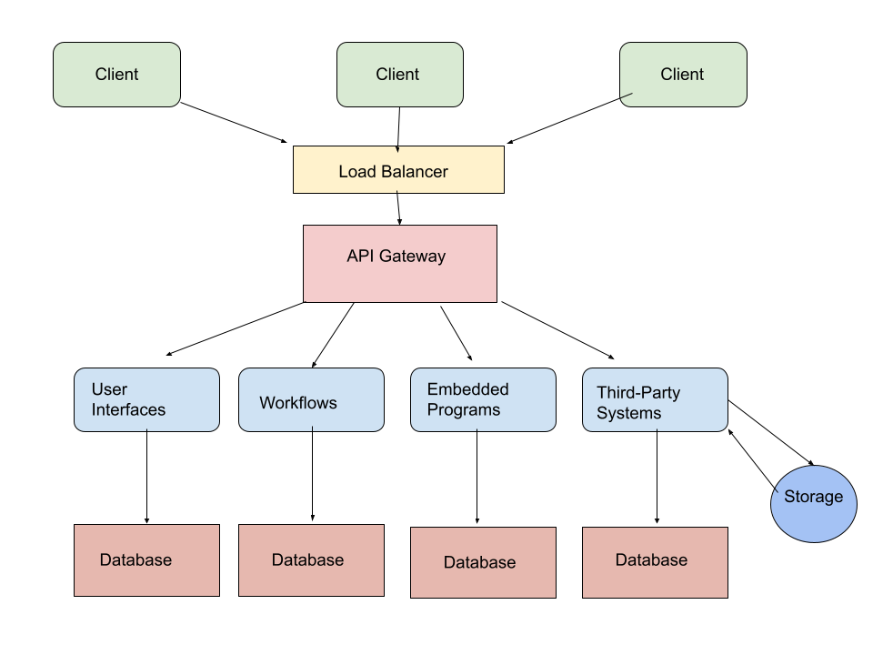

# Lab Report: Architecture
___
**Course:** CIS 411, Spring 2023  
**Instructor(s):** [Trevor Bunch](https://github.com/trevordbunch)  
**Name:** Hope Tressler  
**GitHub Handle:** hopetressler  
**Repository:** https://github.com/hopetressler/cis411_lab2_arch  
**Collaborators:** 
___

# Step 1: Confirm Lab Setup
- [X] I have forked the repository and created my lab report
- [X] I have reviewed the [lecture / discsussion](../assets/04p1_SolutionArchitectures.pdf) on architecture patterns.
- [X] If I'm collaborating on this project, I have included their handles on the report and confirm that my report is informed, but not copied from my collaborators.

# Step 2: Analyze the Proposal
Serve Central is an application designed to offer registration for volunteer events and hold all event and company information in one location. Serve Central also uses user statistic tracking. 

## Step 2.1 Representative Use Cases  

| Use Case #1 | |
|---|---|
| Title | Registration for Event - Volunteer|
| Description / Steps | 1. User navigates to volunteer web page and selects desired event.  2. User selects registration button labeled "Register for Event".   3. User submits information on a form containing additional required information.   4. User confirms registration when once information has been entered.   5. User registration is submitted and the registration confirmation is needed.   6. User is redirected to the home page.|
| Primary Actor | Volunteer |
| Preconditions | 1. The user has an account and is logged in.|
| Postconditions | 1. The user is registered for an event in Serve Central.   2. The user can access their registered events on a page in the application. |

| Use Case #2 | |
|---|---|
| Title | Add Event - Service Agency |
| Description / Steps | 1. A service agency employee navigates to their profile page and hits "Create Event" option.   2. The employee fills out an event form with information required (title, location, time, description).|
| Primary Actor | Service Agency |
| Preconditions | 1. The service agency is already a member of Serve Central as a service agency. |
| Postconditions | 1. The service agency's event is posted as a possible event to be searched for. |

## Step 2.2 Define the MVC Components

| Model | View | Controller |
|---|---|---|
| Event Database | Webpage with Event List | Processes search criteria and gives resulted list of events |
| Volunteer Account Database  | Webpage with Sign Up/Login for Volunteers | Sign Up: Processes input username, email, and password. Adds account to database.    Login: Processes input information (username and password), searches the database for account, and gives access to user. |
| Service Agency Account Database | Webpage with Sign Up/Login for Service Agencies | Sign Up: Processes input username, email, and password. Adds account to database.    Login: Processes input information (username and password), searches the database for account, and gives access to user. |
| Map Data | Search for Event | Searches for events with the criteria input. |

## Step 2.3 Diagram a Use Case in Architectural Terms

.png)

**Description**

This is a use case diagram given in an MVC architecture. It is for a user registering for an event. 

# Step 3: Enhancing an Architecture

## Step 3.1 Architecture Change Proposal

The microservices architectural pattern would work well for Serve Central. Microservices is an architecture that leverages brokered communication to support independent changes and recombination on all layers of the architecture. This architecture would support Serve Central's desire to have application embedded in different organizations. The microservice architectural pattern is good for Serve Central because it works well with simple APIs. Microservices has a flexible design and Serve Central can have the opportunity to implement new services. Large companies such as Twitter and Netflix use microservice architecture. With microservices architecture, there is easy maintenance, scalability, and agility. Some of the drawbacks include increased development time and limited reuse of code. This can be an expensive solution. 

## Step 3.2 Revised Architecture Diagram
 

**Description**

This is a diagram that features the microservices architecture. It includes a load balancer and meets the needs for a solution to two problems for Serve Central: (1) third-party services and (2) building organization.

# Step 4: Scaling an Architecture

  1. A load balancer in the API gateway would be beneficial because Serve Central hopes to expand their number of users. 
  2. If Serve Central expands, there would need to be a third party dealing with storage added. Because microservices architecture has a flexible design, it would be easy to implement the use of third-party services. 

If adding a load balancer in the API gateway, there will likely need to be multiple backend servers in order to support the increased traffic caused by users. The drawbacks of this proposal simply comes down to expense. It will be expensive to store over 50 TB of data. 
# Extra Credit
If you opt to do extra credit, then include it here.