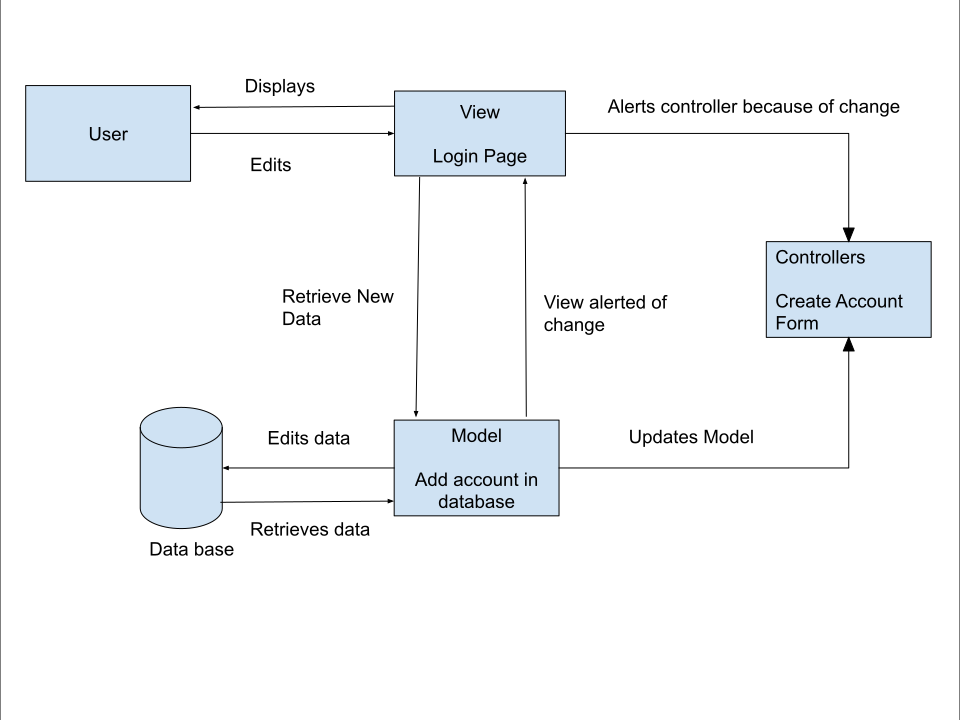

# Lab Report: Architectural Patterns
___
**Course:** CIS 411, Spring 2021  
**Instructor(s):** [Trevor Bunch](https://github.com/trevordbunch)  
**Name:** [Joseph McGillen]  
**GitHub Handle:** jm1959  
**Repository:** Your Forked Repository  
**Collaborators:** Mike Shoul
___

# Step 1: Confirm Lab Setup
- [x] I have forked the repository and created my lab report
- [x] I have reviewed the [lecture / discussion](../assets/04p1_SolutionArchitectures.pdf) on architecture patterns.
- [x] If I'm collaborating on this project, I have included their handles on the report and confirm that my report is informed, but not copied from my collaborators.

# Step 2: Analyze the Proposal 
Serve Central wants to create a web application that simplify the process of finding new volunteer opportunities.
All the registration and all event and company information should be in one location, and user statistic tracking.

## Step 2.1 Representative Use Cases  

| Use Case #1 |Find an event - Volunteer|
|---|---|
| Title| As a potential Serve Central user, I want to search for a certain event|
| Description / Steps| 1. The user hits ```login```  <br> 2. Once verified the user navigates to the events page <br> 3. User can click on the search bar and enter the name of a certain event <br> 4.The correct event is displayed after the user clicks the search button|                                                                                                    
| Primary Actor| Volunteer|
| Preconditions| 1. The user has an account associated with their email|
| Postconditions| 1. The events are filtered based off of the user's search request|

| Use Case #2 |One company/organization event hosted on app - Service Agencies|
|---|---|
| Title |As a Service Agency, I want to make sure that companies/organizations can host events and have users register for them |
| Description / Steps |1. The company/organization his the ```login``` button 2. After being verified the company/organization navigates to the events page and clicks ```add event``` <br> 3. The company/organization fills out a add event form (company/organization name, event type, location, max number of attendees) <br> 4. The form will validate that each condition is filled out <br> 5. After conformation the company/organization is redirected to the events page and an email confirmation that the event was posted |
| Primary Actor |company/organization |
| Preconditions |1. Company/organization has an account associated with their email |
| Postconditions |1. Event is displayed so that is viewable by the users <br> 2. The event allows users to register <br> 3. The event and details are stored correctly in the database |

## Step 2.2 Define the MVC Components

| Model                 | View                 | Controller              |
|-----------------------|----------------------|-------------------------|
|Users                  |Account page          |Show location from event |
|Companies/Organizations|Event page            |register for event       |
|Events                 |Map page              |Show Event types         |
|                       |Sign in/Sign up page  |Create/edit profile      |
|                       |Create/edit event page|Create/edit event        |


## Step 2.3 Diagram a Use Case in Architectural Terms


# Step 3: Enhancing an Architecture

## Step 3.1 Architecture Change Proposal
The architectural pattern that is appropriate to meet all requirements is Broker. This architectural pattern separates services and components though the use of a communication broker. The benefits of using this architecture is that it makes the service distribution transparent to clients. So for third party services there is no worry about losing data or affecting another party as each party would have their own server. The broker will receive their request and route the request to the right server. This would also help with building organization-specific interfaces on top of the Serve central business and data as all organizations would get their own server. One drawback of this architectural pattern is that it may introduce overhead. Since there are many different servers that the broker will be routing to there can be an excess of computation time,and bandwidth that will slow down the overall time it takes to process requests 

## Step 3.2 Revised Architecture Diagram


# Step 4: Scaling an Architecture
With the continuos growth of Serve Central it would be vital to switch the microservice architectural pattern. The microservice architectural pattern arranges an application as a collection of services communicating through lightweight protocols. The benefits that come from using this architecture is the ability to handle the increase of active user as each application process get their own service and each service has they're own database. When it comes to the issue of exceeding 50TB of data and allowing authorized parties to issue queries that traverse the TB's of data, the microservice architectural pattern has flexible scaling and allows each service to be scaled independently. This will also help with enabling researchers to examine patterns of volunteer opportunities as they can see which services are being used more than other because they will need to be scaled more than others. Some draw backs of using this architectural pattern is increased network traffic as each service is relying on the network to communicate with each other. Also there is a higher complexity now with the independent service making it challenging to track down errors. These changes are vital so that Serve Central can stay up to date and continue to grow, keeping their service available to their increasing number of users.