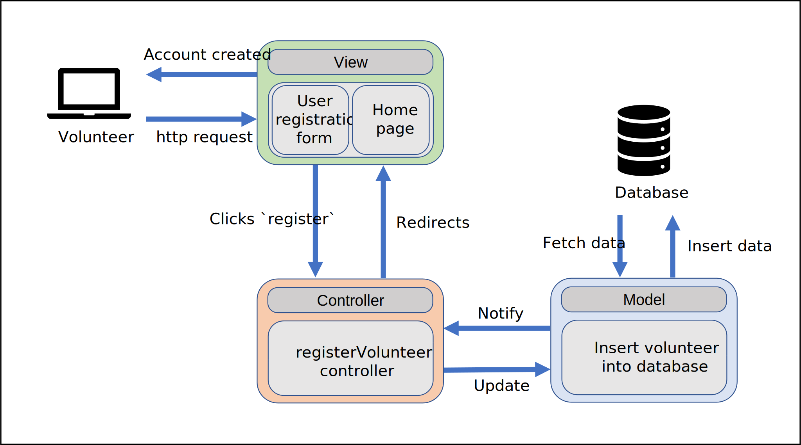
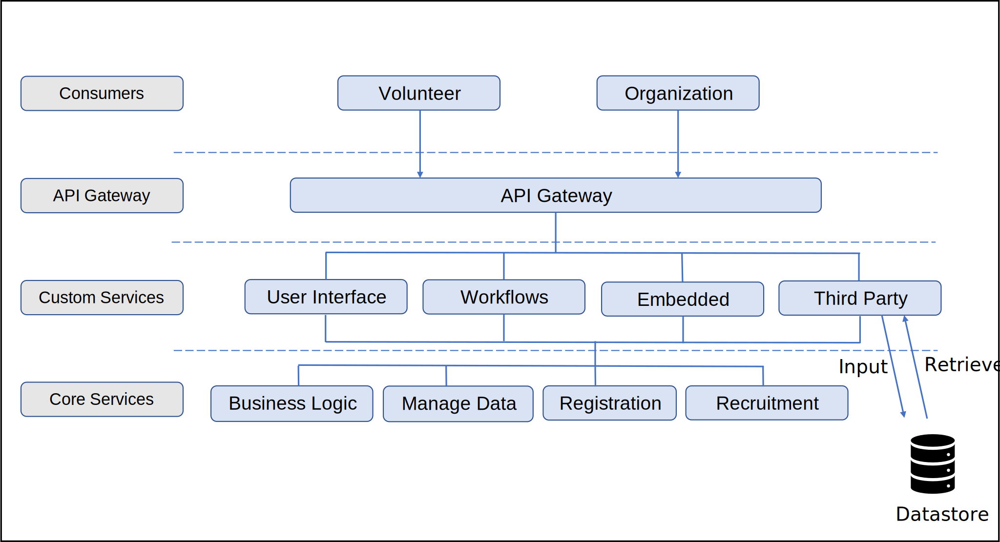

# Lab Report: Architecture
___
**Course:** CIS 411, Spring 2023  
**Instructor(s):** [Trevor Bunch](https://github.com/trevordbunch)  
**Name:** Michael Shoul  
**GitHub Handle:** [m-shoul](https://github.com/m-shoul)  
**Repository:** [m-shoul / cis411_lab2_arch](https://github.com/m-shoul/cis411_lab2_arch)  
**Collaborators:** None
___

# Step 1: Confirm Lab Setup
- [x] I have forked the repository and created my lab report
- [x] I have reviewed the [lecture / discussion](../assets/04p1_SolutionArchitectures.pdf) on architecture patterns.
- [x] If I'm collaborating on this project, I have included their handles on the report and confirm that my report is informed, but not copied from my collaborators.

# Step 2: Analyze the Proposal
Serve central empowers individuals to effortlessly discover new and impactful volunteer opportunities while providing in-depth company and event information, all in one convenient location. With just a single application, users can effortlessly register and take the first step toward making a difference within the community.

## Step 2.1 Representative Use Cases  

| Use Case #1 | |
|---|---|
| Title | User Registration - Volunteer |
| Description / Steps | 1. An individual accesses the Serve central website and selects the ```Register as Volunteer``` button. <br>2. The individual fills out a registration form including their full name, email, address, desired password, password confirmation, and agreement to the terms of service. <br>3. The form validates the following: A valid email address, matching passwords, and an acknowledged terms of service agreement. <br>4. Upon successful account creation, the user is redirected to the home page in a logged-in state, with a banner reminder to activate their account.|
| Primary Actor | Volunteer |
| Preconditions | None |
| Postconditions | 1. The user has a temporary account associated with their email address. <br>2. The user receives an email confirmation to activate their account. |

| Use Case #2 | |
|---|---|
| Title | Volunteer History - Volunteer |
| Description / Steps | 1. The user navigates to the Serve Central website and clicks ```Login```. <br>2. The user logs into the account using their existing email address and password associated with the account. <br>3. The user navigates to the ```Profile``` section. <br>4. The volunteer can view a list of all the events they have registered for and the hours they have volunteered for each event. <br>5. The volunteer can view more details about each event, such as the date, location, and description. |
| Primary Actor | Volunteer |
| Preconditions | 1. The user must have an activated account. <br>2. The user must be successfully logged into Serve Central. |
| Postconditions | The volunteer has a clear understanding on the number of hours they have volunteered and the events they have participated in. |

| Use Case #3 | |
|---|---|
| Title | Posting An Event - Organization |
| Description / Steps | 1. The user representing the organization navigates to the Serve Central website and clicks ```Login```. <br>2. The user navigates to the ```Create Event``` section. <br>3. The user fills out the event details form, including the event name, date, location, description, volunteer roles, and number of volunteers needed. <br>4. The user uploads ant relevant images or flyers for the event. <br>5. The user makes sure the information is correct and submits the event listing for review. <br>6. Upon approval, the event is posted on the Service Central platform and visible to volunteers. |
| Primary Actor | Organization |
| Preconditions | 1. The organization has an activated account. <br>2. The user must be successfully logged into Serve Central. |
| Postconditions | 1. The organization has an event posted for potential volunteers. <br>2. The organization receives an email confirmation for the event listing. |

## Step 2.2 Define the MVC Components

| Model | View | Controller |
|---|---|---|
| Volunteer | Volunteer Profile | registerVolunteer |
| Event | Event Listings | registerEvent |
| Organization | Event Details | showEventInfo |
| Registration | Organization Profile | registerOrganization |

## Step 2.3 Diagram a Use Case in Architectural Terms

* This is a diagram of use case #1, which provides a visual representation of the how the MVC architecture handles a volunteer registering for an account.




# Step 3: Enhancing an Architecture

## Step 3.1 Architecture Change Proposal
Given the tremendous growth of Serve Central and the new requirements they must meet, it would be most appropriate to implement a microservices architectural pattern.

The microservices architecture pattern breaks down a complex system into smaller, independent services that communicate with each other through APIs. This pattern is well suited for the integration of third-party services, as it allows for easy integration of external services with the Serve Central model/datastore.

In this architecture, each third-party service could be treated as a separate microservice, responsible for inputting an retrieving data from the Serve Central model/datastore. This would allow for easy integration and management of third-party services, as well as flexible scaling and deployment. Also, the microservices architectural pattern is best for building organization-specific interfaces on top of the Serve Central business and data logic. This architecture allows for the development of separate microservices for each organization specific interface, so each organization can have a custom experience that meets its needs.

Although the implementation of a microservices architecture seems like it may solve all problems, there are still some potential drawbacks. The increased number of separate microservices also increases the complexity and coordination required to manage them. This issue would require communication between microservices to be well defined and managed through APIs. Additionally, debugging and troubleshooting issues may arise with the increased number of microservices.


## Step 3.2 Revised Architecture Diagram

* This is the newly proposed microservice architectural pattern that supports the two new requirements for Serve Central.




# Step 4: Scaling an Architecture
Given the new requirements from the profound growth of Serve Central, I still believe that a microservice architecture would be the most appropriate. This approach would still allow Serve Central to accommodate growth, handle high volumes of data, and support the need of authorized parties to issue queries and analyze data.

To handle the bursts of 10k+ new volunteers per hour, a volunteer opportunity microservice can be designed to handle a high volume of data and ensure that the submission of a new volunteer opportunity and its availability in the registration service are processed with low latency.

The data management microservice can use a database that is designed to scale horizontally to handle the large amount of data. It is also important that the data is highly available as well. Highly available data is important because authorized parties should be able to issue queries that traverse through the TB's of data stored in the datastore. A data warehousing solution in the microservices architecture can be used to process and analyze the large amounts of data.

The data warehousing solution can also be used to support data analysis for researchers to examine patterns of volunteer opportunities. The data can be analyzed through machine learning algorithms, statistical models, and visualization tools to determine future grant investments.

However, scaling the microservices architecture can also present some drawbacks. Overall, the architecture becomes more complex and presents more difficult challenges with testing, deployment, monitoring, and security. As well as with the increased amounts of data, it may be challenging to ensure the data across multiple services is consistent.

Although this may be a lot to digest, it is important to be able to implement changes to handle the increased load and be able to maintain the system so that it is always available and accessible to all users.