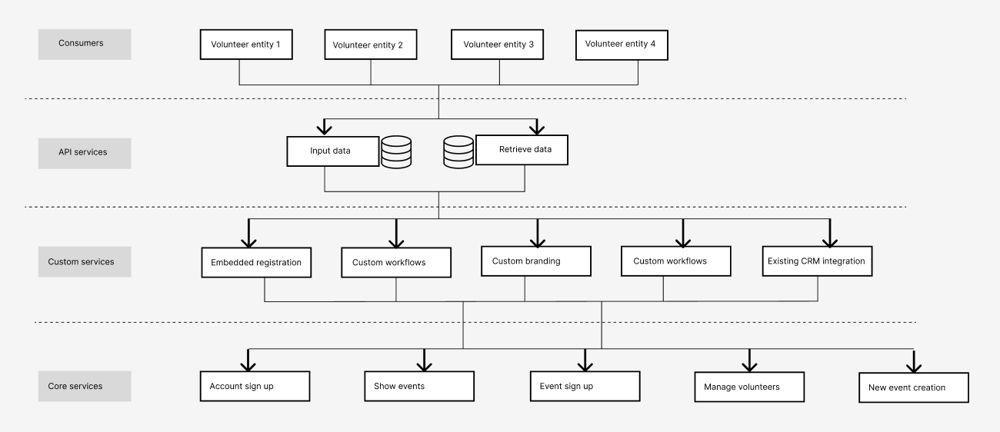

# Lab Report: Continuous Integration
___
**Course:** CIS 411, Spring 2021  
**Instructor(s):** [Trevor Bunch](https://github.com/trevordbunch)  
**Name:** Ray Truex  
**GitHub Handle:** rt1252  
**Repository:** [Your Forked Repository](https://github.com/rt1252/cis411_lab2_arch)  
**Collaborators:** NA
___

# Step 1: Confirm Lab Setup
- [x] I have forked the repository and created my lab report
- [x] I have reviewed the [lecture / discsussion](../assets/04p1_SolutionArchitectures.pdf) on architecture patterns.
- [x] If I'm collaborating on this project, I have included their handles on the report and confirm that my report is informed, but not copied from my collaborators.

# Step 2: Analyze the Proposal
Serve Central is an app that connects volunteers with events needing volunteers. All event data is handled in app from finding the event to signing up for the event to volunteer at.

## Step 2.1 Representative Use Cases  

| Use Case #1 | |
|---|---|
| Title |Volunteer searches for event|
| Description / Steps |1. An individual navigates to the ServeCentral webpage and clicks the map icon.  2. The individual is able to pinch to zoom in and out to view events near their location and in surrounding areas.  3. The individual clicks on an event which opens a new page which displays event information (event name, event location, event description, event date, event time, and other information).|
| Primary Actor |Volunteer |
| Preconditions |1. The user is signed into their account. 2. The user has enabled access to their location. |
| Postconditions |None |

| Use Case #2 | |
|---|---|
| Title |Volunteer registers for event |
| Description / Steps |1. The individual clicks the register button. 2. The event registration form is autofilled with saved account information.  3. The individual completes any remaining required parts of the form.  4. The individual is shown a success/checkmark animation.  5. The individual is redirected to the page of events they have volunteered for.  6. The top of the application displays a banner with the option to download an .ics calendar file.|
| Primary Actor |Volunteer |
| Preconditions |1. The user is signed into their account.  2. The user has already used the map function to search and find an event. |
| Postconditions |1. The event shows up under the page showing events the user has signed up for.  2. The user receives email confirmation of their registration. |

| Use Case #3 | |
|---|---|
| Title |Event host requests their event to be displayed |
| Description / Steps |1. The individual navigates to the event builder form.  2. The individual inputs event information such as name, location, description, date, time, number of volunteers needed, and other information.  3. A ServeCentral employee will verify the event information and publish the event to the application.|
| Primary Actor |Event host |
| Preconditions |1. Event host is signed into their account. 2. Event host has been vetted as legit. |
| Postconditions |The event is displayed on the map for volunteers to see. |

| Use Case #4 | |
|---|---|
| Title |Event host sends messages to volunteers |
| Description / Steps |1. The individual selects the event that they want to manage volunteers for.  2. The event host can choose which users the message goes to or can select all. 3. The event host fills out a message form which sends a push notification to the volunteers. |
| Primary Actor |Event host |
| Preconditions |The user has active events that have received volunteers. |
| Postconditions |The volunteers receive information regarding the event. |

## Step 2.2 Define the MVC Components

| Model              | View                    | Controller              |
|--------------------|-------------------------|-------------------------|
| Profile            | Account page            | showProfileController   |
| Event Map          | Events map              | showMapController       |
| Event Info         | Event information page  | showEventInfoController |
| Event Registration | Event registration form | eventRegistrationController        | 

## Step 2.3 Diagram a Use Case in Architectural Terms
Use case 1 - Volunteer searches for event including MVC.

Use case 2 - Volunteer registers for event including MVC.

# Step 3: Enhancing an Architecture

## Step 3.1 Architecture Change Proposal
Given the two new requirements that Serve Central needs to implement a microservices architecture would be most appropriate. Microservices uses brokered communication while supporting independent changes. This is perfect for the scenario of adding new volunteer entities that would need to input and receive data from the database and building organization specific interfaces on top of the Serve Central business/data logic. 

Using the microservice architecture, the application is broken into smaller independent services. Each service could represent a specific volunteer entity. The microservice architecture would allow these third party volunteer entities to integrate easily using APIs to input and retrieve data from the Serve Central model/datastore. In addition this architecture would allow for organization-specific custom interfaces that could be customized while being built on top of Serve Centrals business and data logic.

While the microservice architecture is the best solution to meet the new requirements it comes with some drawbacks. Mainly being that overhead and complexity is introduced as each service is a separate entity. These services add complexity and can increase communication latency as data must be retrieved from an API. Due to this added overhead troubleshooting problems also become more difficult.

## Step 3.2 Revised Architecture Diagram
The new architecture meeting the two new requirements described above using the microservice architecture.

# Step 4: Scaling an Architecture
I still think that using microservice architecture is the best way to meet the future needs of the grant. New services can be added for each requirement ensuring that services are separated from each other allowing the requirements to be met.

For example, the availability of the submitted opportunity would be one service, another service would be increased database servers, another service would be for examining patterns.

Another architecture would need to be implemented as well to make sure that these requirements can be met. I ensure that these services are properly load balanced with appropriate resources making sure that the services do not become overwhelmed. Ideally the load balancer would be able to dynamically scale up or down depending on demand. 

# Extra Credit
1. Extra credit diagram of final architecture:

2. Step 5: Submitting a pull request has instructions from a previous assignment:
   
   What step 5, part 3 currently says: "Choose the base fork tangollama/cis411_lab0 is the target and that your fully updated main branch is the source."

   What step 5, part 3 should say: "Choose the base fork trevordbunch/cis411_lab2_arch is the target and that your fully updated main branch is the source."

