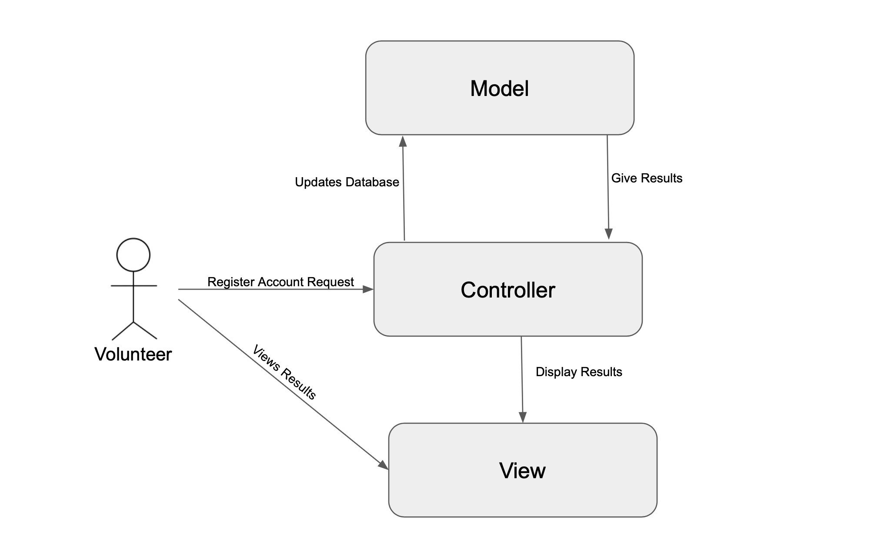
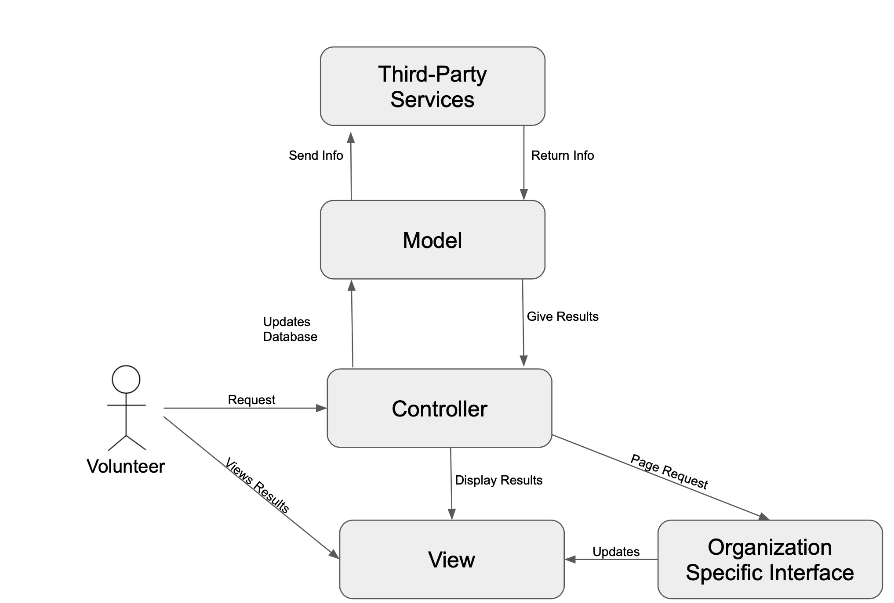

# Lab Report: Continuous Integration
___
**Course:** CIS 411, Spring 2023  
**Instructor(s):** [Trevor Bunch](https://github.com/trevordbunch)  
**Name:** Tim Kratz  
**GitHub Handle:** timkratz  
**Repository:** https://github.com/timkratz/cis411_lab2_arch.git  
**Collaborators:**  None
___

# Step 1: Confirm Lab Setup
- [x] I have forked the repository and created my lab report
- [x] I have reviewed the [lecture / discsussion](../assets/04p1_SolutionArchitectures.pdf) on architecture patterns.
- [x] If I'm collaborating on this project, I have included their handles on the report and confirm that my report is informed, but not copied from my collaborators.

# Step 2: Analyze the Proposal
Serve Central is a mobile application that allows users to find events that are looking for volunteer opportunitites. On the app you are able to see what the event is, where the event is located, and what kind of volunteers are needed.

## Step 2.1 Representative Use Cases  

| Use Case #1 |Volunteer|
|---|---|
| Title | Signing up to volunteer |
| Description / Steps |<ol> <li> User will login to their account </li><li> User searches through desired events based on the time, event type, and location </li><li> User selects an event and fills out required information </li><li> User will confirm their registration </li><li> User is given registration confirmation </li><li> User is directed back to original search page  |
| Primary Actor |Volunteer |
| Preconditions |<ol> <li> User has created an account </li><li> Serve Central is running and available to use |
| Postconditions |<ol> <li> User is notified of completed signup </li><li> User is notified with instructions about the event and any changes that may occur  |

| Use Case #2 | |
|---|---|
| Title |Creating Volunteering Event |
| Description / Steps |<ol> <li> Orgainization will login to their account </li><li> Organization selects new event registration </li><li> Organization fills out information about event </li><li> Organizations confirms registering their event </li><li> Organization is given confirmation of registered event </li><li> Organization is directed back to original page |
| Primary Actor |Organization |
| Preconditions |<ol> <li> Organization has created an organization account </li><li> Serve Central is running and available to use  |
| Postconditions |<ol> <li> Organization is notified of completed event registration </li><li> Event is displayed so that volnteers can see it |

## Step 2.2 Define the MVC Components

| Model | View | Controller |
|---|---|---|
|Service Events  | Available Events  |EventController  |
|User Registration |User Account Registration  |UserRegistrationController  |
|Event Location  |Event Information  |EventLocationController  |
|Event  |Event Registration  |EventRegistrationController  |

## Step 2.3 Diagram a Use Case in Architectural Terms
- Use case for volunteer account registration
  

# Step 3: Enhancing an Architecture

## Step 3.1 Architecture Change Proposal
If Service Central was to expand they should continue to use the MVC architecture. Change to architecture is something that can be costly and difficult to do. The MVC model already in place can be changed in order to meet their new requirements. A drawback of this could be that it is difficult to support multiple similar views that are on the same model. 

## Step 3.2 Revised Architecture Diagram

- This is a use case with added third-party services and organizations specific interface. When a user wants to volunteer for an event, the model allows third-party services to both send and retrieve data and also allows for info from the model to be changed to an organization specific interface.

# Step 4: Scaling an Architecture
I would implement load balancing. Load balancing is something that can be helpful to use with the increase of traffic. It is a way to improve overall performance, reliability, and scalablity. Load balancing distributes incoming requests across multiple servers or microservers. This is a way to ensure that the system is able to keep working and being responsive even under high traffic use. This would help with the bursts of 10k new volunteer opportunities per hour. Load balancing is something that allows distribution of the load. This would help to keep everything responsive and supporting volunteer and event data. Load balancing also allows for distribution of the load across queries which would be helpful for allowing authorized parties to issue queries that traverse the TB's of data stored in your datastore. The downside to implementing load balancing would be the cost of it. Also, it could lead to a signle point of error resulting in reduced availability. 

