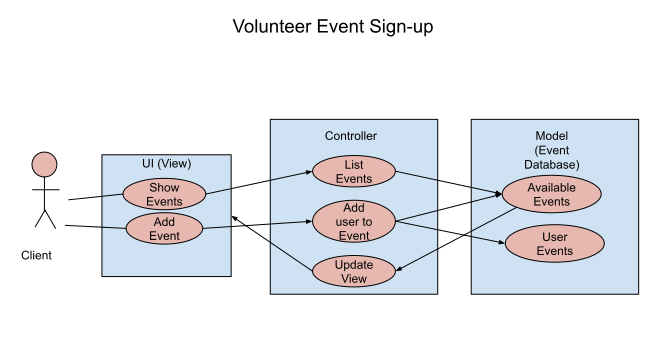
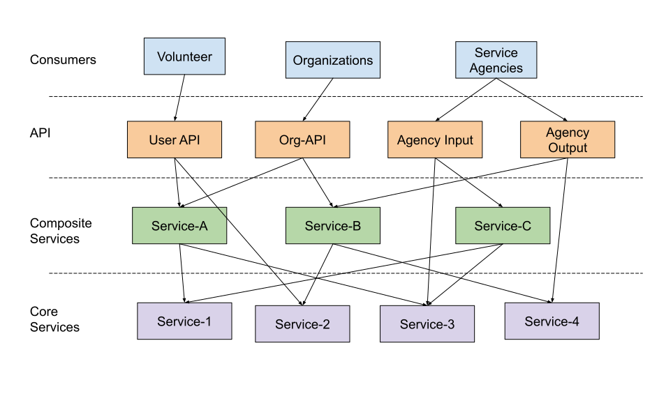

# Lab Report: Continuous Integration
___
**Course:** CIS 411, Spring 2021  
**Instructor(s):** [Trevor Bunch](https://github.com/trevordbunch)  
**Name:** Timothy Lee  
**GitHub Handle:** timothymlee  
**Repository:** [Your Forked Repository](https://github.com/timothymlee/cis411_lab2_arch)  
**Collaborators:** 
___

# Step 1: Confirm Lab Setup
- [x] I have forked the repository and created my lab report
- [x] I have reviewed the [lecture / discsussion](../assets/04p1_SolutionArchitectures.pdf) on architecture patterns.
- [x] If I'm collaborating on this project, I have included their handles on the report and confirm that my report is informed, but not copied from my collaborators.

# Step 2: Analyze the Proposal
Serve Central is a mobile and web app that offer a simple solution for being unable to find volunteering events. It uses user location to find local events, display relevant information, and allow for the user to easily sign-up, all from one place.

## Step 2.1 Representative Use Cases  

| Use Case #1 | Volunteer Event Sign-up |
|---|---|
| Primary Actor | Volunteer |
| Description | A volunteer signs-up for a listed service event |
| Preconditions | <ul><li>The user is authenticated by loggin into their account</li><li>The user is sharing location data</li></ul> |
| Steps | <ol><li>User opens list of nearby service events</li><li>User select desired event</li><li>The system provides details about the service agency and the event</li><li>The user selects to sign-up for the event</li><li>The system pulls the user's stored information from the account and prompts for number of participants to sign-up</li><li>The system adds the event to the user's account and updates the event</li></ol> |
| Postconditions | <ul><li>The event is added to the user's account</li><li>The number of participants is updated for the event</li></ul>|

 

| Use Case #2 | Service Agency Event Creation |
|---|---|
| Primary Actor | Service Agency |
| Description | A service agency creates a service event|
| Preconditions | <ul><li>The service agency is a registered agency</li></ul> |
| Steps | <ol><li>The user selects to create a new event</li><li>The system prompts the user for a description and information about the date, cause, maximum number of participants, and location.</li><li>The system pulls information about the service agency to add to the event description</li><li>The user enters and confirms data.</li><li>The system adds the event to the database</li></ol> |
| Postconditions | <ul><li>The event is added to the database</li></ul> |

## Step 2.2 Define the MVC Components

| Model | View | Controller |
|---|---|---|
| User's Events | List of events user signed up with summaries of the events | Selecting event will bring up all details for the event |
| Agency's Events | Lit of events the agency is hosting with event detail summaries | Selecting events will allow for more details about the details and allow for editing of details |
| Available Events | List of nearby service events | Changes list of options depending on user location |
| Event Creation | Form with different fields to fill out | Updates database of events and outputs confirmation |

## Step 2.3 Diagram a Use Case in Architectural Terms

The image above is an illustration of Use Case #1 in the MVC format. The user can click to show the available events. The request is then sent to the controller which makes a query in the database to retrieve events near the user. The data from that query is then pushed from the controller to update the view. The user can then select to add an event, triggering another controller action which will update the event's participant data and add the event to the user's list of events. That will then be available for the user to view.

# Step 3: Enhancing an Architecture

## Step 3.1 Architecture Change Proposal
A microservice architecture would be a suitable archiecture solution to the new requirements. Since a microservice architecture is a collection of small apps that perform specific tasks. Those apps then serve as the foundation of other apps which server as the foundation for other apps, continued up to the overall web app. With the addition of the four primary volunteer entities in the US, scalability is an important concern and the microservice architecture handles this well. Additionally, the different apps can be used to create the different APIs necessary to input and recieve data from and to thirdparty services. It would also allow for different interfaces to be built on top of the Serve Central business and data logic, because  the different apps already made as the foundation of the Serve Central can be combined again and formatted differently for the specific organizations.
One significant drawback that should be considered is the complexity, which could lead to long development times. With such, it may not be ready in time for the desired launch date.

## Step 3.2 Revised Architecture Diagram

A microservice is an architecture with many smaller apps that serve as foundations for larger apps, eventually building the webpage. As per the requirements, there will be different services for both large service agencies, consumers, and individual organizations. Each service is built on the different layers of apps that have other apps that serve as their foundation, each performing a specific task, like database interfacing.

# Step 4: Scaling an Architecture
Continuing to use the microservice architecture would still be the optimal solution. While the current aps may not support everything that the Gates Foundation would like, more apps can be built and incorporated into the overall applicaiton. The microservice structure scales very well, especially compared to formats like MVC. Different tasks could be then incorporated into different API to fit the needs of the specific customer target of each individual API. It would allow for multiple databases to support the large amount of data. Each database could have a microservice created for interfacing with that database, allowing for different authorized parties to issue queries. The format also allows for large volumes of users and researchs to analyze patterns. As previously stated, the complexity of the structure could lead to long development time and a need for more developers.

# Extra Credit
If you opt to do extra credit, then include it here.