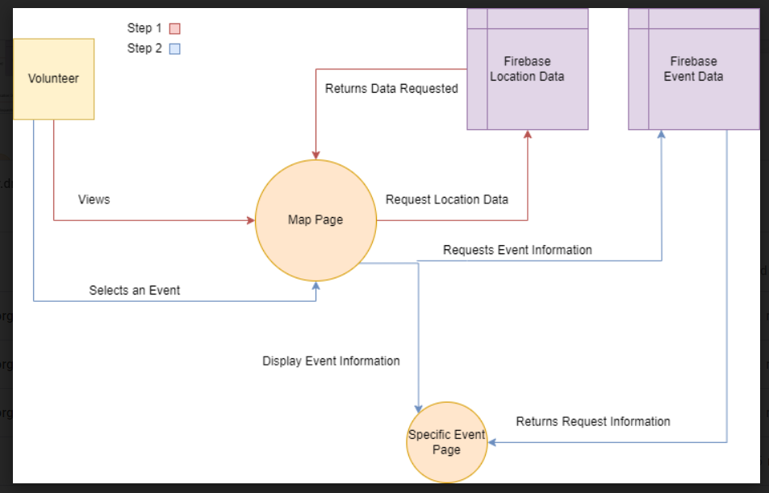
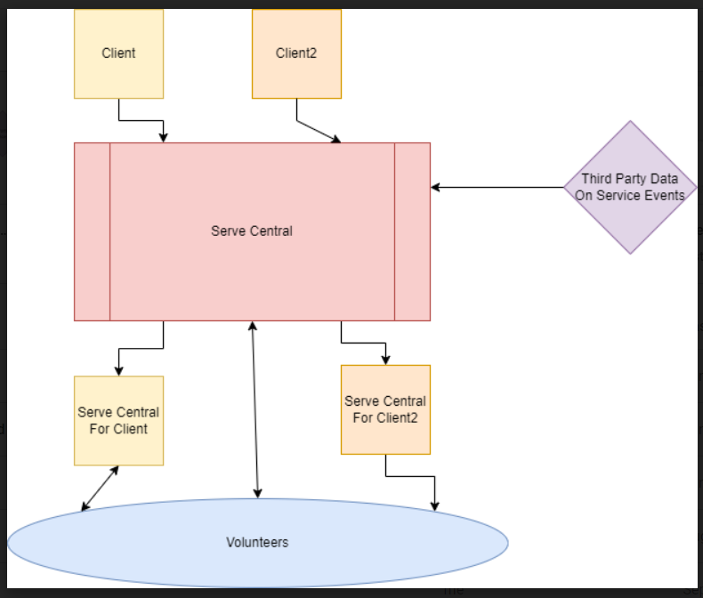

# Lab Report: Continuous Integration
___
**Course:** CIS 411, Spring 2022  
**Instructor(s):** [Trevor Bunch](https://github.com/trevordbunch)  
**Name:** Tyler Regitz  
**GitHub Handle:** [ztigerR](https://github.com/ztigerR)  
**Repository:** [Repo](https://github.com/ztigerR/cis411_lab2_arch)  
 
___

# Step 1: Confirm Lab Setup
- [ ] I have forked the repository and created my lab report
- [ ] I have reviewed the [lecture / discsussion](../assets/04p1_SolutionArchitectures.pdf) on architecture patterns.
- [ ] If I'm collaborating on this project, I have included their handles on the report and confirm that my report is informed, but not copied from my collaborators.

# Step 2: Analyze the Proposal
Serve Central is an online application that will provide the user locations of avaliable service work near their location. The applciation comes with online registartion for each event avaliable that way users can find and sign up for a serivce in one application. 

## Step 2.1 Representative Use Cases  

| Use Case #1 | |
|---|---|
| Title | Volenteer looking for a Service|
| Description / Steps |The user is looking for a service to helpout with. He/She uses service central to find one close by. He/She registars for the event and proceeds to the event at the correct time mention in the application. |
| Primary Actor |Thoughtful Human |
| Preconditions |  Volenteer has free time The is a service avalible during the free time The service is within 5 miles of the users location |
| Postconditions | The service hours are added to the users profile The user will be notified when another service like this has appear|

| Use Case #2 | |
|---|---|
| Title |Service Agencies |
| Description / Steps | A Church is setting up a soup and sandwhich event and is still looking for volenteers. They add their event to the service central complete with the time of the event, what the volunteer needs to registar, and the location of the event.|
| Primary Actor | Church |
| Preconditions | The Church must have an avalible space to host the event. |
| Postconditions | The event will be removed from the system after the event ends |

## Step 2.2 Define the MVC Components

| Model | View | Controller |
|---|---|---|
| Adds User Information to the Firebase | Registar Users Page | Forum Entry |
| Adds/Removes locations to an interactive map | Map Page | Locations are clickable |
| Updates User Information in the database after an event | User/Service Profile Page | Formum to update user profile |
| Organizes Information from the database about the event  | Event Page | Button for Sign up |

## Step 2.3 Diagram a Use Case in Architectural Terms

This diagram shows the user interaction with two view pages one controller and two models. The User can view the Map page and Event page. The Map page requires a model that calculates distance to events from the users current location. Then those events become controllers, clickable buttons, that takes the user to the second view of an Event page. This page uses a model that will get information about the event and display it on the page from the database.

# Step 3: Enhancing an Architecture

## Step 3.1 Architecture Change Proposal
A broker archietecture is a good fit for meeting the new requirements. This application can act like a middle man for clients that want to use the service to get to new audiances of volunteers. Service Central as a broken can be change for differnet clients that want to use the application. Service Central can also act as its own client by using third-party software to gather more volunteer data that can be dispalyed on the map page. One problem that could occur with this is having redundent data in our databases because of clients want to have their own application.

## Step 3.2 Revised Architecture Diagram

This diagram shows how ServeCentral can be a broker for clients aswell as still a service for people looking to volunteer and the events that ServeCentral support come from thirdparty data. 

# Step 4: Scaling an Architecture
A broker Architecture will still work for the new application because other parties are going to need access to our database having the service following the broker model will allow easier access to the data. Plus a broker can implement load balances that will work to split up the trafic to mulitple servers. The final requirement can be fullied by adding another model to the base MVC that can keep track of the clicks that Events get. This change is need because Serve Central was not tracking this information before. No comment on the concequences.
